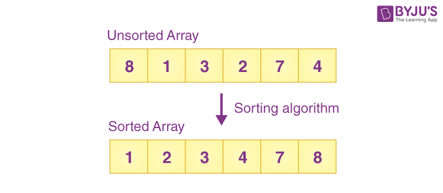

# Introduction to Sorting

## What is Sorting?

**Sorting** refers to rearrangement of a given array or list of elements according to a comparison operator on the elements. The comparison operator is used to decide the new order of elements in the respective data structure.

* Sorting means reordering of all the elements either in ascending or in descending order.

---

## Applications of Sorting

* **Searching Algorithms:** Sorting is often a crucial step in search algorithms like binary search, Ternary Search, where the data needs to be sorted before searching for a specific element.

* **Data management:** Sorting data makes it easier to search, retrieve, and analyze.

* **Database optimization:** Sorting data in databases improves query performance.

* **Machine learning:** Sorting is used to prepare data for training machine learning models.

* **Operating Systems:** Sorting algorithms are used in operating systems for tasks like task scheduling, memory management, and file system organization.

## Sorting Algorithms

* **Selection Sort**
* **Bubble Sort**
* **Insertion Sort**
* **Merge Sort**
* **Quick Sort**
