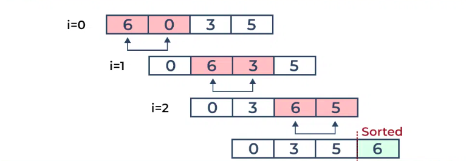

# Bubble Sort Algorithm

**Bubble Sort** is the simplest sorting algorithm that works by repeatedly swapping the adjacent elements if they are in the wrong order. This algorithm is not suitable for large data sets as its average and worst-case time complexity is quite high.





**In Bubble Sort algorithm**

* Traverse from left and compare adjacent elements and the higher one is placed at right side.

* In this way, the largest element is moved to the rightmost end at first.

* This process is then continued to find the second largest and place it and so on until the data is sorted.


---

??? tip "Practice question"

    * <a href="https://www.geeksforgeeks.org/problems/bubble-sort/1?utm_source=youtube&utm_medium=collab_striver_ytdescription&utm_campaign=bubble-sort" target="_blank">Bubble Sort (gfg)</a>

    ---


```cpp

void bubbleSort(int arr[], int n) {
        
    for(int i = 0 ; i < n ; i++){
        for(int j = 0 ; j < n-i-1 ; j++){
            if(arr[j] > arr[j+1]){
                swap(arr[j],arr[j+1]);
            }
        }
    }
}


```


**Time complexity: O(N^2)**  (where N = size of the array), for the worst, and average cases.


**Space Complexity: O(1)**


---


**Optimized approach (Reducing time complexity for the best case):**


The best case occurs if the given array is already sorted. We can reduce the time complexity to O(N) by just adding a small check inside the loops. 

* We will check in the first iteration if any swap is taking place. If the array is already sorted no swap will occur and we will break out from the loops. 

* Thus the iteration of the outer loop will be just 1. **And our overall time complexity will be O(N)**.


```cpp

void bubbleSort(int arr[], int n) {
        
    for(int i = 0 ; i < n ; i++){
        int didSwap = 0;
        for(int j = 0 ; j < n-i-1 ; j++){
            if(arr[j] > arr[j+1]){
                swap(arr[j],arr[j+1]);
                didSwap = 1;
            }
        }
        if(didSwap == 0){
            break;
        }
    }
}


```


