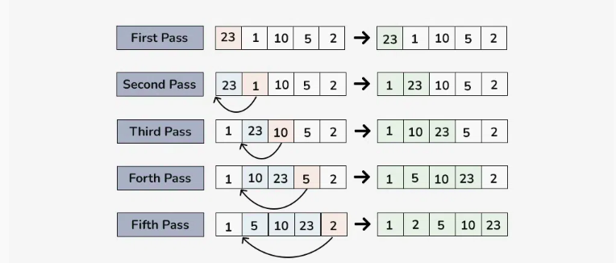

# Insertion Sort Algorithm


**Insertion sort** is a simple sorting algorithm that works by building a sorted array one element at a time. It is considered an **in-place** sorting algorithm, meaning it doesn’t require any additional memory space beyond the original array.





**Algorithm:**


* We have to start with second element of the array as first element in the array is assumed to be sorted.

* Compare second element with the first element and check if the second element is smaller then swap them.

* Move to the third element and compare it with the second element, then the first element and swap as necessary to put it in the correct position among the first three elements.

* Continue this process, comparing each element with the ones before it and swapping as needed to place it in the correct position among the sorted elements.

* Repeat until the entire array is sorted.


```cpp


void insertion_sort(int arr[], int n) {
    for (int i = 0; i <= n - 1; i++) {
        int j = i;
        while (j > 0 && arr[j - 1] > arr[j]) {
            swap(arr[j-1],arr[j]);
            j--;
        }
    }
}


```


**Time complexity: O(N^2)**  (where N = size of the array), for the worst, and average cases.


**Space Complexity: O(1)**


---


**Best Case Time Complexity:** 


The best case occurs if the given array is already sorted. And if the given array is already sorted, the outer loop will only run and the inner loop will run for 0 times. So, our overall **time complexity in the best case will boil down to O(N),** where N = size of the array.


