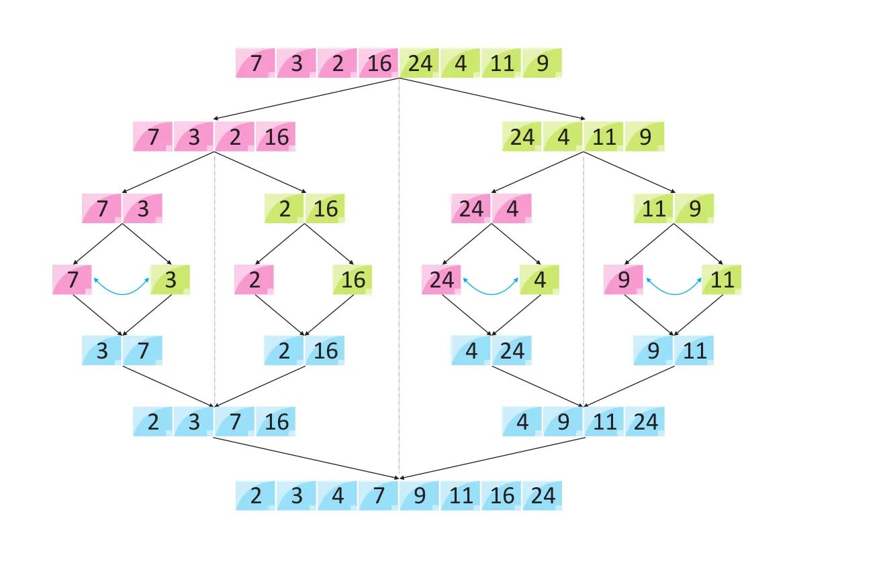

# Merge Sort Algorithm


**Merge sort** is a sorting algorithm that follows the **divide-and-conquer** approach. It works by recursively dividing the input array into smaller subarrays and sorting those subarrays then merging them back together to obtain the sorted array.


**How does Merge Sort work?**


Here’s a step-by-step explanation of how merge sort works:

1. **Divide:** Divide the list or array recursively into two halves until it can no more be divided.

2. **Conquer:** Each subarray is sorted individually using the merge sort algorithm.

3. **Merge:** The sorted subarrays are merged back together in sorted order. The process continues until all elements from both subarrays have been merged.





---


**Approach:**


**We will be creating 2 functions `mergeSort()` and `merge()`**


1. **mergeSort(arr[], low, high):**

    * In order to implement merge sort we need to first divide the given array into two halves. Now, if we carefully observe, we need not divide the array and create a separate array, but we will divide the array's range into halves every time. For example, the given range of the array is 0 to 4(0-based indexing). Now on the first go, we will divide the range into half like (0+4)/2 = 2. So, the range of the left half will be 0 to 2 and for the right half, the range will be 3 to 4. Similarly, if the given range is low to high, the range for the two halves will be low to mid and mid+1 to high, where mid = (low+high)/2. This process will continue until the range size becomes.

    * So, in **mergeSort(),** we will divide the array around the middle index(rather than creating a separate array) by making the recursive call :
        * **mergeSort(arr,low,mid)**   [Left half of the array]
        * **mergeSort(arr,mid+1,high)**  [Right half of the array]
        where low = leftmost index of the array, high = rightmost index of the array, and mid = middle index of the array.

    * Now, in order to complete the recursive function, we need to write the base case as well. We know from step 2.1, that our recursion ends when the array has only 1 element left. So, the leftmost index, low, and the rightmost index high become the same as they are pointing to a single element.
    **Base Case:** if(low >= high) return;


    ??? tip "Pseudocode of `mergeSort()` function"

        ```cpp

        void mergeSort(vector<int> &arr, int low, int high){

            if (low >= high) return;
            int mid = (low + high) / 2 ;

            mergeSort(arr, low, mid);  // left half
            mergeSort(arr, mid + 1, high); // right half
            merge(arr, low, mid, high);  // merging sorted halves
        }

        ```


2. **merge(arr[], low, mid, high):**


    * In the merge function, we will use a temp array to store the elements of the two sorted arrays after merging. Here, the range of the left array is low to mid and the range for the right half is mid+1 to high.

    * Now we will take two pointers left and right, where left starts from low and right starts from mid+1.

    * Using a while loop( while(left <= mid && right <= high)), we will select two elements, one from each half, and will consider the smallest one among the two. Then, we will insert the smallest element in the temp array.

    * After that, the left-out elements in both halves will be copied as it is into the temp array.

    ??? tip "Pseudocode of `merge()` function"

        ```cpp

        void merge(vector<int> &arr, int low, int mid, int high){

            vector<int> temp; // temporary array
            int left = low;      // starting index of left half of arr
            int right = mid + 1;   // starting index of right half of arr

            //storing elements in the temporary array in a sorted manner
            while (left <= mid && right <= high) {
                if (arr[left] <= arr[right]) {
                    temp.push_back(arr[left]);
                    left++;
                }
                else {
                    temp.push_back(arr[right]);
                    right++;
                }
            }

            // if elements on the left half are still left
            while (left <= mid) {
                temp.push_back(arr[left]);
                left++;
            }

            //  if elements on the right half are still left
            while (right <= high) {
                temp.push_back(arr[right]);
                right++;
            }

            // transfering all elements from temporary to arr
            int z = 0;
            for (int i = low; i <= high; i++) {
                arr[i] = temp[z];
                z++;
            }
        }

        ```


---


**Code**


??? tip "Practice question"

    * <a href="https://www.geeksforgeeks.org/problems/merge-sort/1?utm_source=youtube&utm_medium=collab_striver_ytdescription&utm_campaign=merge-sort" target="_blank">Merge Sort (gfg)</a>

    ---


```cpp

#include <bits/stdc++.h>
using namespace std;

void merge(vector<int> &arr, int low, int mid, int high){

    vector<int> temp; // temporary array
    int left = low;      // starting index of left half of arr
    int right = mid + 1;   // starting index of right half of arr

    //storing elements in the temporary array in a sorted manner
    while (left <= mid && right <= high) {
        if (arr[left] <= arr[right]) {
            temp.push_back(arr[left]);
            left++;
        }
        else {
            temp.push_back(arr[right]);
            right++;
        }
    }

    // if elements on the left half are still left
    while (left <= mid) {
        temp.push_back(arr[left]);
        left++;
    }

    //  if elements on the right half are still left //
    while (right <= high) {
        temp.push_back(arr[right]);
        right++;
    }

    // transfering all elements from temporary to arr //
    int z = 0;
    for (int i = low; i <= high; i++) {
        arr[i] = temp[z];
        z++;
    }
}

void mergeSort(vector<int> &arr, int low, int high){

    if (low >= high) return;
    int mid = (low + high) / 2 ;

    mergeSort(arr, low, mid);  // left half
    mergeSort(arr, mid + 1, high); // right half
    merge(arr, low, mid, high);  // merging sorted halves
}

int main() {

    vector<int> arr = {9, 4, 7, 6, 3, 1, 5}  ;
    int n = 7;

    cout << "Before Sorting Array: " << endl;
    for (int i = 0; i < n; i++) {
        cout << arr[i] << " "  ;
    }
    cout << endl;

    mergeSort(arr, 0, n - 1);

    cout << "After Sorting Array: " << endl;
    for (int i = 0; i < n; i++) {
        cout << arr[i] << " "  ;
    }
    cout << endl;

    return 0 ;
}

```


**Time Complexity:**

* **Best Case: O(n log n),** When the array is already sorted or nearly sorted.
* **Average Case: O(n log n),** When the array is randomly ordered.
* **Worst Case: O(n log n),** When the array is sorted in reverse order.


Reason: At each step, we divide the whole array, for that logn and we assume n steps are taken to get sorted array, so overall time complexity will be **O(n log n)**

**Space complexity: O(n)**

Reason: We are using a temporary array to store elements in sorted order.


**Auxiliary Space Complexity: O(n)**

