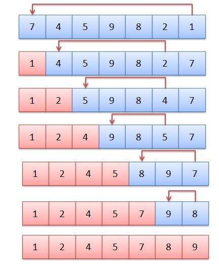

# Selection Sort Algorithm

The algorithm repeatedly selects the smallest (or largest) element from the unsorted portion of the list and swaps it with the first element of the unsorted part. This process is repeated for the remaining unsorted portion until the entire list is sorted.





**The algorithm steps are as follows:**

* First, we will select the range of the unsorted array using a loop (say i) that indicates the starting index of the range.
The loop will run forward from 0 to n-1. The value i = 0 means the range is from 0 to n-1, and similarly, i = 1 means the range is from 1 to n-1, and so on.(Initially, the range will be the whole array starting from the first index.)

* Now, in each iteration, we will select the minimum element from the range of the unsorted array using an inner loop.

* After that, we will swap the minimum element with the first element of the selected range(in step 1).

* Finally, after each iteration, we will find that the array is sorted up to the first index of the range.


**Note:** Here, after each iteration, the array becomes sorted up to the first index of the range. That is why the starting index of the range increases by 1 after each iteration. This increment is achieved by the outer loop and the starting index is represented by variable i in the following code. And the inner loop(**i.e. j**) helps to find the minimum element of the range **[i…..n-1].**


```cpp

#include<bits/stdc++.h>
using namespace std;

void selection_sort(int arr[], int n){

  for (int i = 0; i < n - 1; i++) {
    for (int j = i + 1; j < n; j++){
      if (arr[j] < arr[i]){
        swap(arr[i],arr[j]);
      }
    }
  }
}

int main(){
    
  int arr[] = {13,46,24,52,20,9};
  int n = sizeof(arr) / sizeof(arr[0]);

   cout << "Before selection sort: ";
   for(int i = 0; i < n; i++){
    cout << arr[i] << " ";
  }
  cout << "\n";

  selection_sort(arr, n);

  cout << "After selection sort: ";
  for(int i = 0; i < n; i++){
    cout << arr[i] << " ";
  }
  cout << "\n";

  return 0;
}

```


**Time complexity: O(N^2)** (where N = size of the array), for the best, worst, and average cases.


**Space Complexity: O(1)**

