# Stack Data Structure

## What is Stack ?

A **Stack** is a linear data structure that follows a particular order in which the operations are performed. The order may be **LIFO(Last In First Out)** or **FILO(First In Last Out)**. **LIFO** implies that the element that is inserted last, comes out first and **FILO** implies that the element that is inserted first, comes out last.


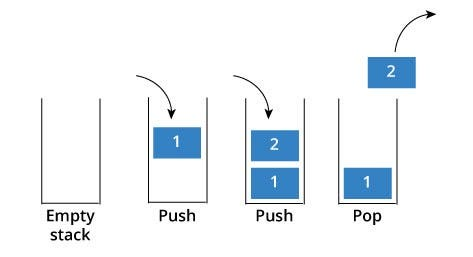


---


## Operations on Stack :

* **Push**: Adds an element to the top of the stack.
* **Pop**: Removes the top element from the stack.
* **Top**: Returns the top element without removing it.
* **IsEmpty**: Checks if the stack is empty.
* **IsFull**: Checks if the stack is full (in case of fixed-size arrays).


## Applications of Stack :

* Depth-First Search (DFS)
* Undo/Redo Operations
* Browser History


## Stack in C++ STL

```cpp

stack<data_type> name;


```

* **empty()** – Returns whether the stack is empty – Time Complexity : O(1) 
* **size()** – Returns the size of the stack – Time Complexity : O(1) 
* **top()** – Returns a reference to the top most element of the stack – Time Complexity : O(1) 
* **push(g)** – Adds the element ‘g’ at the top of the stack – Time Complexity : O(1) 
* **pop()** – Deletes the most recent entered element of the stack – Time Complexity : O(1) 

 

## Questions

💡 First try with yourself, if you are unable to solve the question then see the solution.


??? tip "Implement Stack using Arrays"

    * <a href="https://www.geeksforgeeks.org/problems/implement-stack-using-array/1?utm_source=youtube&utm_medium=collab_striver_ytdescription&utm_campaign=implement-stack-using-array" target="_blank">Implement Stack using Arrays (gfg)</a>


    ---


    ```cpp

    #include<bits/stdc++.h>
    using namespace std;

    class Stack {
        int size;
        int * arr;
        int top;
        public:
            Stack() {
            top = -1;
            size = 1000;
            arr = new int[size];
            }
        void push(int x) {
            top++;
            arr[top] = x;
        }
        int pop() {
            int x = arr[top];
            top--;
            return x;
        }
        int Top() {
            return arr[top];
        }
        int Size() {
            return top + 1;
        }
    };
    int main() {

        Stack s;
        s.push(6);
        s.push(3);
        s.push(7);
        cout << "Top of stack is before deleting any element " << s.Top() << endl;
        cout << "Size of stack before deleting any element " << s.Size() << endl;
        cout << "The element deleted is " << s.pop() << endl;
        cout << "Size of stack after deleting an element " << s.Size() << endl;
        cout << "Top of stack after deleting an element " << s.Top() << endl;

        return 0;
    }


    ```


??? tip "Implement Stack using Queues"

    * <a href="https://leetcode.com/problems/implement-stack-using-queues/description/" target="_blank">Implement Stack using Queues (leetcode)</a>


    ---

    **Approach :**

    * Take a single queue.
    * push(x): Push the element in the queue.
    * Use a for loop of size()-1, remove element from queue and again push back to the queue, hence the most recent element becomes the most former element and vice versa.
    * pop(): remove the element from the queue.
    * top(): show the element at the top of the queue.
    * size(): size of the current queue.

    **Repeat "step 3" at every insertion of the element.**

    ---


    ```cpp

    #include<bits/stdc++.h>
    using namespace std;

    class Stack {
        queue < int > q;
        public:
            void Push(int x) {
            int s = q.size();
            q.push(x);
            for (int i = 0; i < s; i++) {

                q.push(q.front());
                q.pop();
            }
            }
        int Pop() {
            int n = q.front();
            q.pop();
            return n;
        }
        int Top() {
            return q.front();
        }
        int Size() {
            return q.size();
        }
    };

    int main() {

        Stack s;

        s.Push(3);
        s.Push(2);
        s.Push(4);
        s.Push(1);
        cout << "Top of the stack: " << s.Top() << endl;
        cout << "Size of the stack before removing element: " << s.Size() << endl;
        cout << "The deleted element is: " << s.Pop() << endl;
        cout << "Top of the stack after removing element: " << s.Top() << endl;
        cout << "Size of the stack after removing element: " << s.Size();

    }

    ```

??? tip "Valid Parentheses"

    * <a href="https://leetcode.com/problems/valid-parentheses/description/" target="_blank">Valid Parentheses (leetcode)</a>


    ---

    ```cpp

    bool isValid(string s) {
        
        stack<char> st;

        for(int i = 0 ; i < s.length() ; i++){
            if(s[i] == '(' || s[i] == '[' || s[i] == '{'){
                st.push(s[i]);
            }
            else{
                if(st.empty()){
                    return false;
                }

                char ch = st.top();
                if(ch == '(' && s[i] == ')' || ch == '{' && s[i] == '}' || ch == '[' && s[i] == ']'){
                    st.pop();
                }
                else{
                    return false;
                }
                
            }
        }

        if(!st.empty()){
            return false;
        }
        return true;
    }


    ```

??? tip "Implement Min Stack"

    * <a href="https://leetcode.com/problems/min-stack/description/" target="_blank">Implement Min Stack (leetcode)</a>


    ---


    ```cpp

    class MinStack {
    public:

        stack<pair<int,int>> st;

        MinStack() {
            
        }
        
        void push(int val) {
            if(st.empty()){
                st.push({val,val});
            }
            else{
                st.push({val , min(st.top().second , val)});
            }
        }
        
        void pop() {
            st.pop();
        }
        
        int top() {
            int val = st.top().first;
            return val;
        }
        
        int getMin() {
            return st.top().second;
        }
    };


    ```

??? tip "Infix to Postfix Conversion"


    **Try below expression on pen and paper using below algorithm** 🥈 🥇


    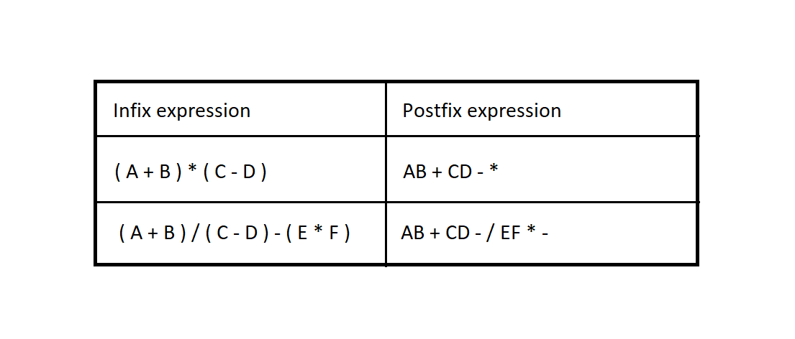


    ---

    **Approach: To convert Infix expression to Postfix**

    1. Scan the infix expression from **left to right**.

    2. If the scanned character is an operand, add it to the **answer**. 

    3. Else, 

        * If the precedence of the scanned **operator** is greater than the precedence of the operator in the stack or the stack is empty or the stack contains a **"("**, push the character into the stack. 
        * Else, **Pop** all the operators from the stack and add it to **answer** which are greater than or equal to the precedence than that of the scanned operator. After doing that **Push** the scanned operator to the **stack**. 

    4. If the scanned character is an "(", push it into the stack. 

    5. If the scanned character is an ")", pop the stack and output it until a "(" is encountered, and discard both the parenthesis. 

    6. Repeat steps 2-5 until the entire infix expression is scanned. 

    7. Pop and add it to the answer from the stack until it is not empty.


    ---


??? tip "Infix to Prefix Conversion"

    **Try examples on pen and paper using below algorithm** 🥈 🥇

    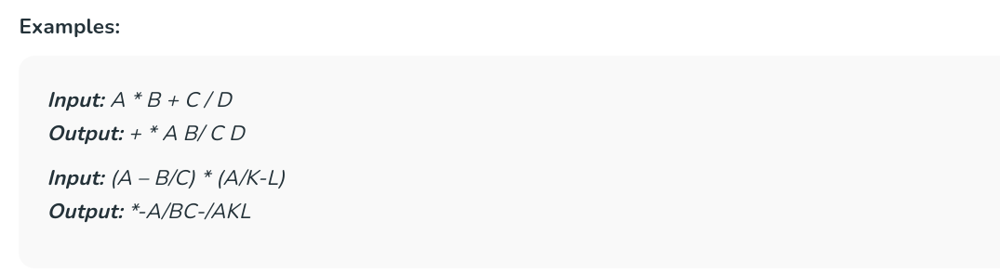


    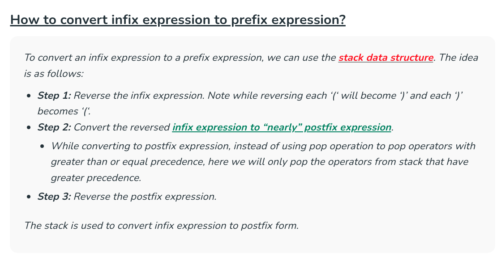


    ---


??? tip "Prefix to Infix Conversion"

    **Try examples on pen and paper using below algorithm** 🥈 🥇

    


    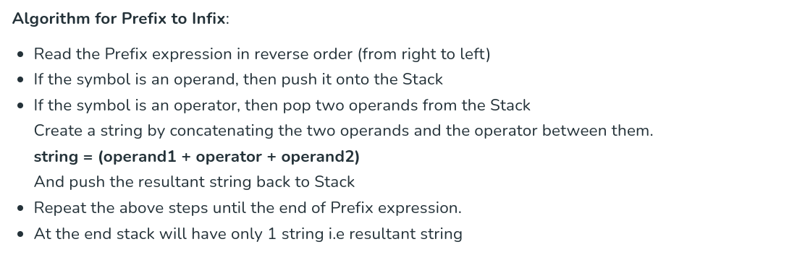


    ---


??? tip "Prefix to Postfix Conversion"

    **Try examples on pen and paper using below algorithm** 🥈 🥇

    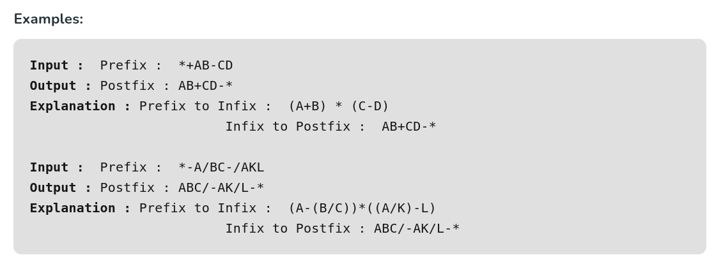


    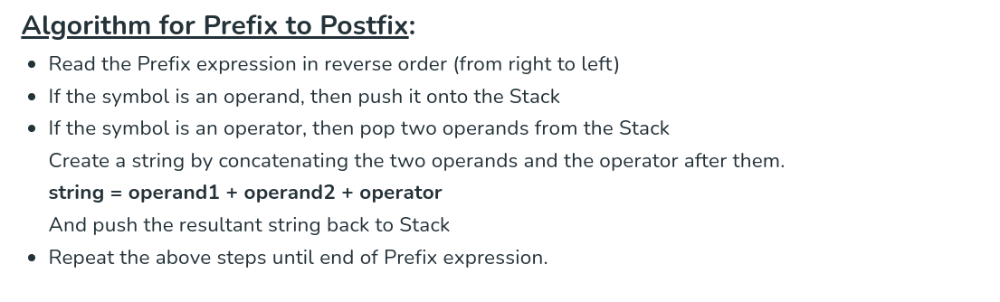


    ---


??? tip "Postfix to Prefix Conversion"

    **Try examples on pen and paper using below algorithm** 🥈 🥇

    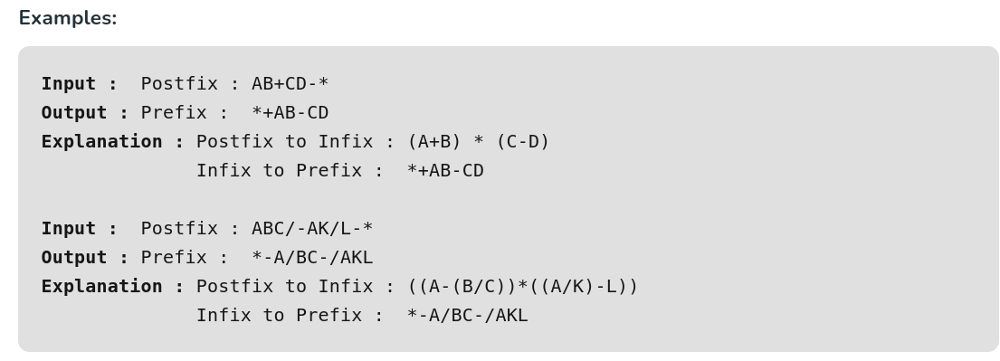


    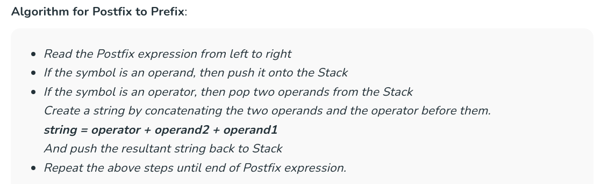


    ---


??? tip "Postfix to Infix Conversion"

    **Try examples on pen and paper using below algorithm** 🥈 🥇

    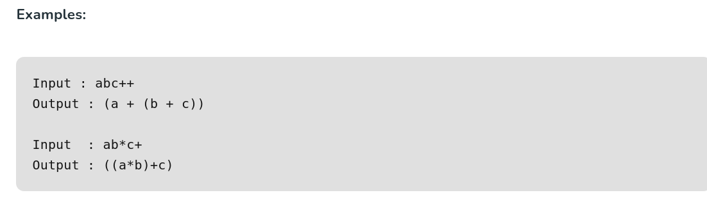


    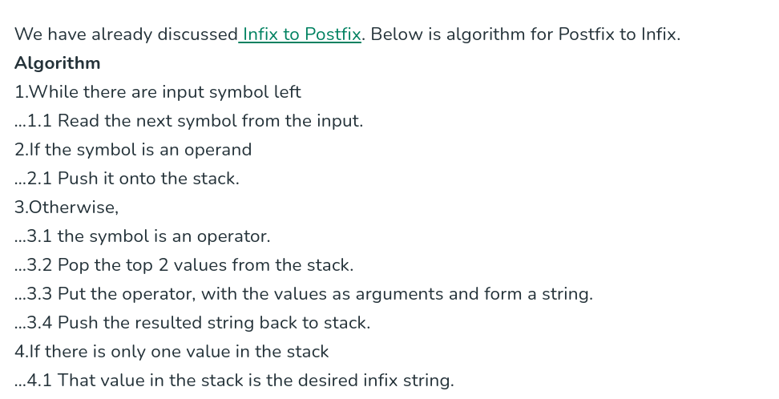


    ---


---

🥇 🥇 🥇


### Other Important Questions List

??? tip "Important Questions List"


    * <a href="https://leetcode.com/problems/next-greater-element-i/description/" target="_blank">Next Greater Element I (leetcode)</a>


    * <a href="https://leetcode.com/problems/next-greater-element-ii/" target="_blank">Next Greater Element II (leetcode)</a>


    * <a href="https://www.interviewbit.com/problems/nearest-smaller-element/" target="_blank">Nearest Smaller Element (interviewbit)</a>


    * <a href="https://leetcode.com/problems/trapping-rain-water/description/" target="_blank">Trapping Rain Water (leetcode)</a>


    * <a href="https://leetcode.com/problems/sum-of-subarray-minimums/description/" target="_blank">Sum of Subarray Minimums (leetcode)</a>


    * <a href="https://leetcode.com/problems/asteroid-collision/" target="_blank">Asteroid Collision (leetcode)</a>


    * <a href="https://leetcode.com/problems/sum-of-subarray-ranges/description/" target="_blank">Sum of Subarray Ranges (leetcode)</a>


    * <a href="https://leetcode.com/problems/remove-k-digits/description/" target="_blank">Remove K Digits (leetcode)</a>


    * <a href="https://leetcode.com/problems/largest-rectangle-in-histogram/description/" target="_blank">Largest Rectangle in Histogram (leetcode)</a>


    * <a href="https://leetcode.com/problems/maximal-rectangle/description/" target="_blank">Maximal Rectangle (leetcode)</a>


💯 🔥 🚀
