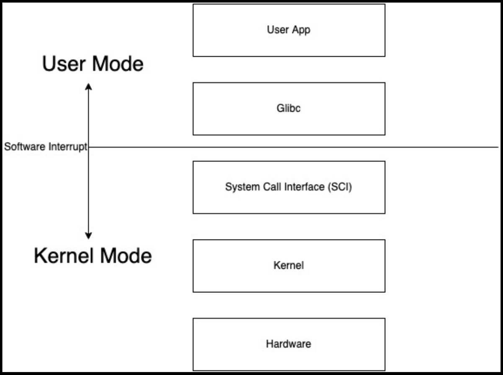
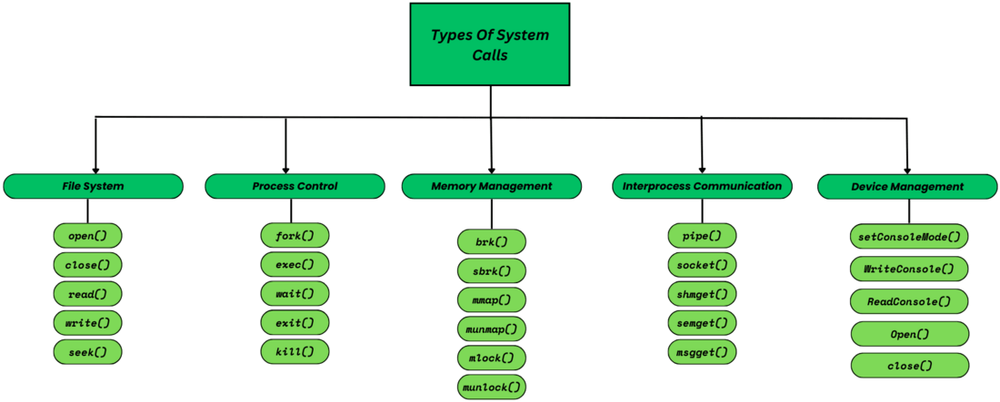
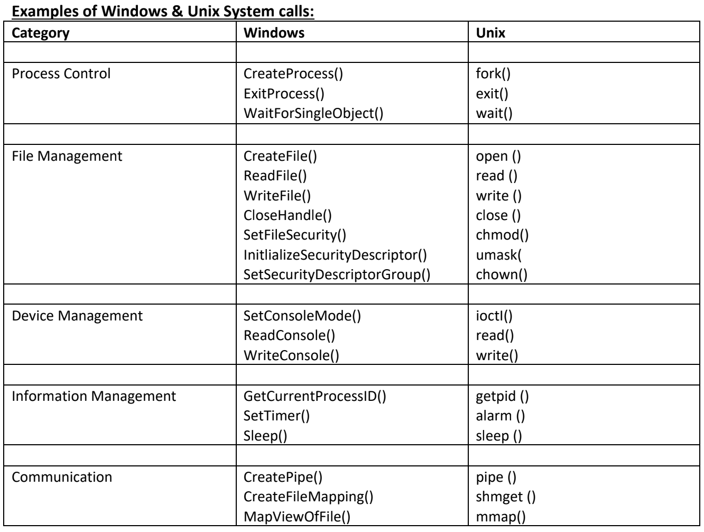

# System Calls

!!! tip "How do apps interact with Kernel?"
    **using system calls**.

## What are system calls?

- **System calls** are special functions that allow user-level programs to request services or resources from the operating system's kernel. Since programs running in **user space** don't have direct access to hardware or core system resources, they rely on system calls to perform tasks that require privileged access, like reading files, allocating memory, or communicating with hardware.
- `System Calls are the only way through which a process can go into kernel mode from user mode.`
- **Transitions from `UserMode` to `KernelMode` done by software interrupts.**
- System Calls are implemented in **C** and **Assembly** language.

## Example:

- Eg. **`mkdir my_dir`**

    - Mkdir indirectly calls kernel and asked the file mgmt. module to create a new directory.
    - Mkdir is just a wrapper of actual system calls.
    - Mkdir interacts with kernel using system calls.   

- Eg. **`Creating a process`**

    - User executes a process. (User space)
    - Gets system call. (US)
    - Exec system call to create a process. (KS)
    - Return to user space.

---

## Types of System Calls:

---

## FAQs 🙋‍♂️

??? bug "Q.1: What is the purpose of System Calls?"
    The purpose of the system calls is to allow user-level applications access of the services provided by the kernel. The user apps do not have the privilege to perform operations, so they make system calls which further requests a kernel to provide a specific service.

??? bug "Q.2: How do device management System Calls work?"
    Device management system calls work by allowing a certain process or a device interact and get access to other hardware resources and perform various operations.

??? bug "Q.3: What is user mode and kernel mode?"
    User mode and kernel modes are two different privilege modes of a Computer System, that separates the execution of operations by the user applications and the kernel on hardware. This separation provides security, stability, and a level of control over system resources.

??? bug "Q.4: What happens when a System Call is executed?"
    When a system call is executed, a context switch occurs and the computer system switches from user mode to kernel mode and now the kernel performs the desired operation.

??? bug "Q.5: What is a software interrupt?"
    A software interrupt is a mechanism through which the OS performs a context switch and transition from user mode to kernel mode. A software interrupt use is not limited only to the system calls but it can also be made when a high priority task is required to be executed by the CPU.

