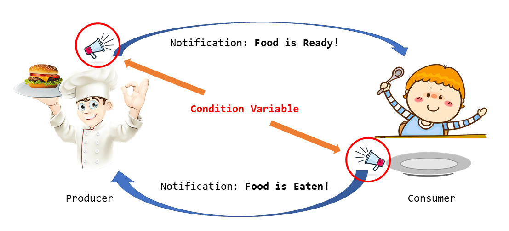
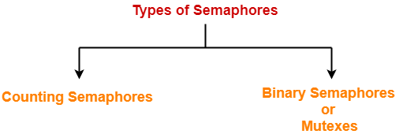
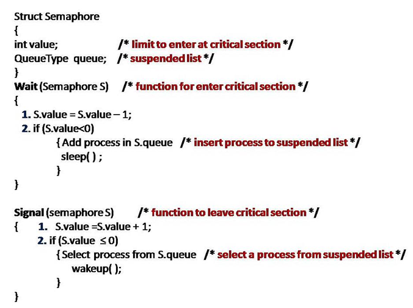

# Conditional variable & Semaphores

## Thread synchronization problem with current approach

So until of now, we have seen couple of approaches, like **using flag boolean value**, **peterson's solution**, and **mutex**.

- The biggest problem with mutex is of **busy waiting**. Until the lock is acquired, another thread has to be in a repetitive while loop of checking if the lock is free or not. So, it's basically wasting CPU clocks. These CPU clocks could have been used by a more meaningful app.

!!! example "**Busy Waiting**"
    Busy waiting, also known as busy looping or spinning, is a process synchronization technique in computer science and software engineering where a process repeatedly checks if a condition is true before executing. For example, a process might check if a lock is available.

To account for this, some new methods were introduced like:

- **Conditional Variables**
- **Semaphores**

---

## Conditional Variables

!!! info ""

    - Condition variables are synchronization primitives that enable threads to wait until a particular condition occurs.

    - There are two types of actions that can be performed with condition variables:
        - **wait**
        - **signal**
    
    - We use the wait instruction in a thread if we want to halt the execution of that thread till a certain condition is met.

    - We use the signal instruction if we want to continue executing the leading thread in the waiting queue.

    - Contention is not here, as after critical section work is done, we will notify others, and they don't have to check every now-and-than and waste CPU cycles.

---

## Semaphores

- Suppose we have a printer that itself has 3 sub-printers, and hence it can print 3 documents at once, so it can execute 3 process at once.
- Semaphore is a synchronization method, in which we have a number which is equal to the number of resources.
- Multiple threads can go and execute `critical section` concurrently.
- Allows multiple program threads to access the finite instance of resources whereas mutex allows multiple threads to access a single shared resource one at a time.

- Binary semaphore: value can be 0 or 1.
    - Aka, **mutex locks**
- Counting semaphore
    - Can range over an unrestricted domain.
    - Can be used to control access to a given resource consisting of a finite number of instances.

!!! info "Semaphore process"
    

    ---

    - To overcome the need for busy waiting, we can modify the definition of the wait () and signal () semaphore operations. When a process executes the wait () operation and finds that the semaphore value is not positive, it must wait. However, rather than engaging in busy waiting, the process car block itself. The block- operation places a process into a waiting queue associated with the semaphore, and the state of the process is switched to the Waiting state. Then control is transferred to the CPU scheduler, which selects another process to execute.

    - A process that is blocked, waiting on a semaphore S, should be restarted when some other process executes a signal () operation. The process is restarted by a wakeup() operation, which changes the process from the waiting state to the ready state. The process is then placed in the ready queue.

---
