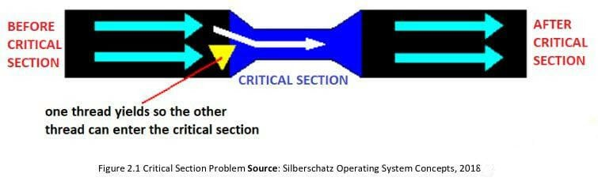
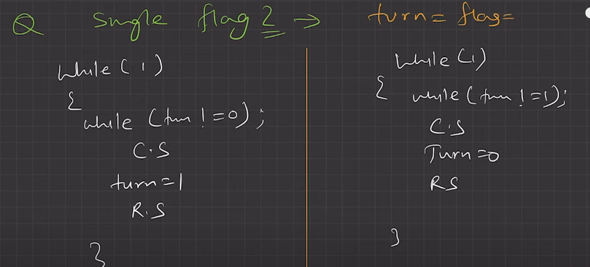
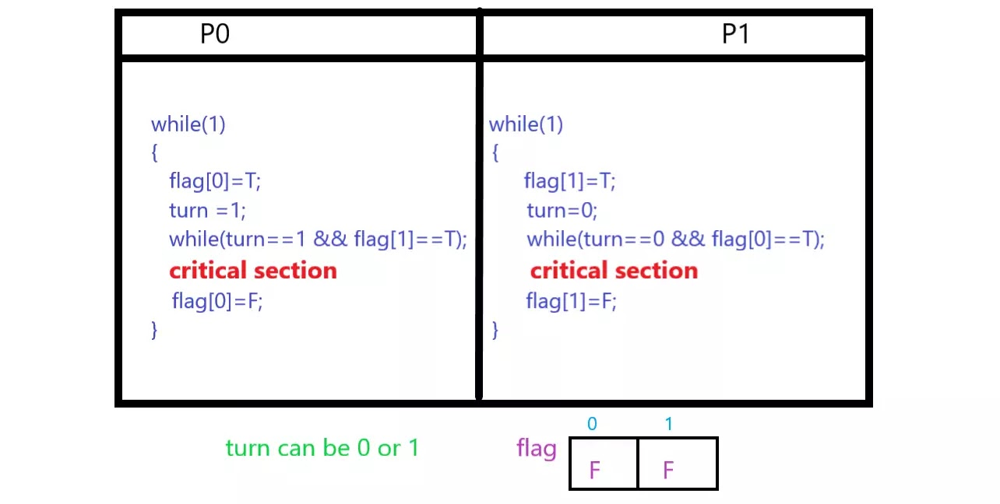

# Critical section & Race condition 🏎️

## Critical Section

!!! info ""
    The critical section refers to the segment of code where processes/threads access shared resources, such as common variables and files, and perform write operations on them.

    - Since processes/threads execute concurrently, any process can be interrupted mid-execution.

---

## Race Condition

!!! tip ""
    - A **race condition occurs when two or more threads can access shared data and they try to change it at the same time**.
    - Because the thread scheduling algorithm can swap between threads at any time, you don't know the order in which the threads will attempt to access the shared data.
    - Therefore, the result of the change in data is dependent on the thread scheduling algorithm, i.e., both threads are "racing" to access/change the data.

---

### Solution to Race Condition

!!! example "Solutions of Race condition"
    - **Atomic operations**: Make Critical code section an atomic operation, i.e., Executed in one CPU cycle.
    - Mutual Exclusion using **`locks`**. (**MutEX**)
    - **Semaphores**

---

## What are the conditions to be full-filled to be a solution to race condition?

!!! warning "Conditions required"
    1. Mutual exclusion (`only one thread goes inside critical section at once`)
    2. Progress (`No thread should stop another thread from entering into critical section, if it's not in the critical section itself`).
    3. Bounded Waiting (`no indefinite waiting`)

    Though we typically don't bother much about `condition-3`, but `1 & 2 condition` are must.

---

## Can we use a simple flag variable to solve the problem of race condition?

- **No**

???+ info "Explanation"
    

    - Let's say, we have a flag `turn`, and two threads are executing.
    - For thread-1, it will be in `while loop until turn is not false (0)`; and for thread-2, it will be in `while loop until turn is not true (1)`.
    - Once while loop breaks, it will go into critical section, and once done with critical section, it will modify the flag, so that other threads can enter in critical section.
    - So, **mutual exclusion** is achieved.
    - But, the problem is, which thread will execute first, depends on the initial value of **`turn` flag**. If it is false by default, thread-1 will execute first, and if thread-2 reaches first, it will still have to wait until thread-1 is done.
    - So, **second-condition of being a solution is not full-filled**.
    - That's why, `single flag can't be used as solution for critical section`. 

---

## Peterson’s solution

- **Peterson's solution can be used to avoid race condition for only 2 processes/ threads**.

???+ example "Detailed description of Peterson's solution to avoid race condition"
    

    - We create a bool `turn`, and a boolean array `flag` of size 2.
    - **flag** denotes, if \(i^{th}\) thread/process can enter critical section or not.

---

## Mutex/Locks

- Locks can be used to implement mutual exclusion and avoid race condition by allowing only one thread/process to access critical section.

!!! bug "Disadvantages"
    - **Contention**: one thread has acquired the lock, other threads will be busy waiting, what if thread that had acquired the lock dies, then all other threads will be in infinite waiting.
    - **Deadlocks** (`one process has locked one critical section, and another process has locked another critical section, and both are waiting for each other to release their part so that they can continue and complete`)
    - **Debugging** (`it's tedious to debug mutex codes`)
    - **Starvation of high priority** (`a low priority process might have locked critical section, and a high priority process will starve`)