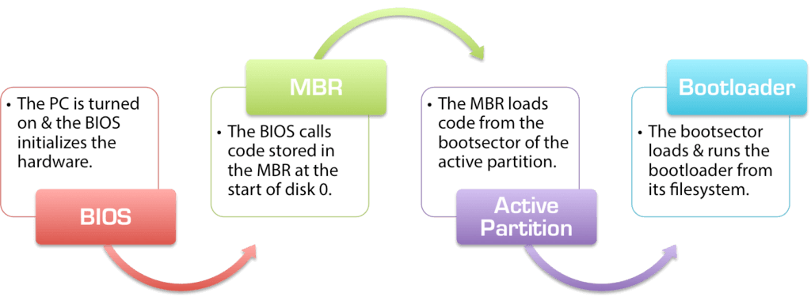

# How Operating System Boots up?

We can describe it in 5 steps:

1. PC power On.

2. **CPU initializes itself and looks for a firmware program (BIOS) stored in BIOS Chip (Basic input-output system chip is a ROM chip found on mother board that allows to access & setup computer system at most basic level.)**
      - In modern PCs, CPU loads **UEFI** (`Unified extensible firmware interface`)

3. CPU runs the BIOS which tests and initializes system hardware. Bios loads configuration settings. If something is not appropriate (like missing RAM) error is thrown and boot process is stopped. This is called **POST (Power on self-test) process**. 
       - (UEFI can do a lot more than just initialize hardware; it’s really a tiny operating system. For example, Intel CPUs have the Intel Management Engine. This provides a variety of features, including powering Intel’s Active Management Technology, which allows for remote management of Business PCs.)

4. BIOS will handoff responsibility for booting your PC to your OS’s **bootloader**.
       - BIOS looked at the MBR (Master Boot Record), a special boot sector at the beginning of a disk The MBR contains code that loads the rest of the OS, known as `bootloader`. The BIOS executes the bootloader, which takes it from there and begins booting the actual OS (windows or linux or mac).
       - Typically, present at the `0th index` of the disk.
       - In other words, BIOS or UEFI examines a storage device on your system to look for a small program, either in MBR or on an EFI system partition, and runs it.

5. The bootloader is a small program that has the large task of booting the rest of the operating system (Boots Kernel then, User Space).
       - **Windows** uses a bootloader named `Windows Boot Manager (Bootmgr.exe)`.
       - most **Linux** systems use `GRUB`, and **Macs** use something called `boot.efi`.