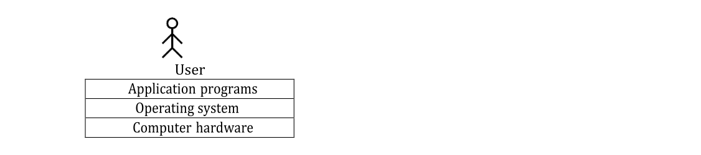

# Introduction to Operating System

## what is an Application software?

The term “**application software**” refers to software that performs specific functions for a user. When a user interacts directly with a piece of software, it is called application software. The sole purpose of application software is to assist the user in doing specified tasks. Microsoft Word and Excel, as well as popular web browsers like Firefox and Google Chrome, are examples of application software.

## what is System software?

**System software** operates and controls the computer system and provides a platform to run application software.Examples of system software include operating systems.

## Why OS?

!!! tip "What if there is no OS?"

    a. Bulky and complex app.(Hardware interaction code must be in app’s code base) 
    b. Resource exploitation by 1 App. 
    c. No memory protection.

## An operating system functions

- Access to the computer hardware.
- interface between the user and the computer hardware
- Resource management (**Aka, Arbitration**) (**memory, device, file, security, process etc**)
- Hides the underlying complexity of the hardware. (**Aka, Abstraction**)
- facilitates execution of application programs by providing isolation and protection.

`The operating system provides the means for proper use of the resources in the operation of the computer system.`

## OS goals

!!! success ""

    * **Maximum CPU utilization**
    * **Less process starvation**
    * **Higher priority job execution**
