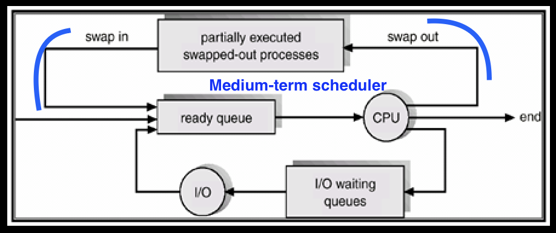

# Swapping (MTS), Context Switching, Orphan and Zombie Process

## Swapping & Medium-term scheduler (MTS) ♓️




!!! info
    - **Long-term scheduler** (or job scheduler) selects which processes should be brought into the ready queue. It aims to **select a good process mix of I/O-bound and CPU-bound processes**.
    - It anticipates their resource usages and then **selects a good process mix**. But its not perfect, and it may over-commit memory. 
    - Hence, we need to free up memory by removing some processes from memory. This is done by **medium-term scheduler** (MTS).
    - **medium-term scheduler (MTS)** is a part of the operating system that **decides which processes to swap in and out of memory**. It is a part of the swapping function.
    - **Swapped-out processes** are placed on the **disk (in swap memory)** and are **swapped-in** when memory becomes available.
    - **Swapping-out** **reduces the degree of multi-programming**, and **swapping-in** **increases** it.

Swapping is a mechanism in which a process can be swapped temporarily out of main memory (or move) to secondary storage (disk) and make that memory available to other processes. At some later time, the system swaps back the process from the secondary storage to main memory.

---

## Context Switching 🔄

- Switching the CPU to another process requires performing a state save of the current process and a state restore of a different process.
- When this occurs, *`the kernel saves the context of the old process in its PCB and loads the saved context of the new process scheduled to run`*.
- **It is pure overhead, because the system does no useful work while switching.**
- Speed varies from machine to machine, depending on the memory speed, the number of registers that must be copied etc.

---

## Orphan process 🧒

- `Each process in the system has a parent process`. The root of the process tree is the **`init process` (with PID=1)**.
- **The process whose parent process has been terminated and it is still running.**
- Orphan processes are adopted by init process.
- Init is the first process of OS. (PID = 1)

??? warning "Practical on Orphan Process"
    1. Create a `orphan-script.sh` file and write the below code in it.
    ```bash
    #!/bin/bash
    sleep 200 & # this will create a child process and detach it from the parent process.
    ```
    - **Run the script** using `./orphan-script.sh` command. (`chmod +x orphan-script.sh` if permission denied)
    - In another terminal, check for the process `sleep` using `ps -al` command. Look for the `PPID` column. It should be `1` (init process).

---

## Zombie process / Defunct process 🧟

- **A zombie process is a process whose execution is completed but it still has an entry in the process table.**
- **Zombie processes usually occur for child processes, as the parent process still needs to read its child’s exit status.**
- `Once this is done using the wait system call, the zombie process is eliminated from the process table. This is known as` **reaping the zombie process**.
- It is because parent process may call wait () on child process for a longer time duration and child process got terminated much earlier.
- **As entry in the process table can only be removed, after the parent process reads the exit status of child process. Hence, the child process remains a zombie till it is removed from the process table.**

??? warning "Practical on Zombie Process"
    1. Create a `zombie-script.sh` file and write the below code in it.
    ```bash
    #!/bin/bash
    for i in {1..100}
    do
        sleep 1&
    done
    exec sleep 100
    ```
    - **Run the script** using `./zombie-script.sh` command. (`chmod +x zombie-script.sh` if permission denied)
    - In another terminal, check for the zombie process using `ps -elf | grep Z` command. There should be 100 zombie processes each with same `PPID` as `zombie-script.sh` process.

---

## Limitations of `Process Table` in OS

- **Process table** is a data structure maintained by the operating system to store information about the processes.
- **Process table** has a limited size, and it is not possible to keep all the processes in the memory all the time.
- **Zombie processes** could fill up the process table and prevent new processes from being created.

!!! info "Maximum number of process table entries"
    - **Windows:** Windows Operating System limits the number of process table entries to **65536**.
    - **Linux:** The maximum number of process table entries in Linux **varies based on the distribution, architecture and kernel version**. In general, it ranges from **32768 to 4194304**.