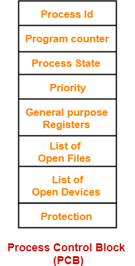

# Introduction to Process Management 🏴‍☠️

!!! success "What is a program?"
    Compiled code, that is ready to execute.

!!! success "What is a process?"
    Program under execution.

!!! success "How OS creates a process? Converting program into a process."

    - Load the program & static data into memory.
    - Allocate runtime stack.
    - Heap memory allocation.
    - IO tasks:
        - After allocating memory, OS then creates I/O descriptors for the process.
        - These descriptors are used to interact with the I/O devices. They are:
            - `input descriptor` (creates a handler that process will use when it needs to read from the input device)
            - `output descriptor` (creates a handler that process will use when it needs to write to the output device)
            - `error descriptor` (creates a handler that process will use when it needs to write to the error device)
    - OS handoffs control to main ().

??? warning "Why do we return 0 from main?"
    - Every process in the OS is created as a child of the `init (root)` process.
    - It is a convention to return 0 from main to indicate that the program has executed successfully.
    - If the program has encountered an error, then we return a non-zero value.
    - In case of an error, the OS can take necessary action based on the return value.

---

## Architecture of a Process in RAM 🏗️

---

## Attributes of a Process

- OS maintains a **Process table** to keep track of all the processes.
- Each process in the table is called a **Process Control Block (PCB)**.
- PCB contains all the information about the process.

---

## PCB structure 📦

- **Process ID (PID)**: Unique identifier for the process.
- **Process State**: Current state of the process. (Running, Ready, Blocked, etc.)
- **Program Counter (PC)**: Microprocessors convert the code into sequence of instructions. PC keeps track of the next instruction to be executed.
- **Registers**: it is a data structure. When a processes is running and it's time slice expires, the current value of process specific registers would be stored in the PCB and the process would be swapped out. When the process is scheduled to be run, the register values is read from the PCB and written to the CPU registers. This is the main purpose of the registers in the PCB.