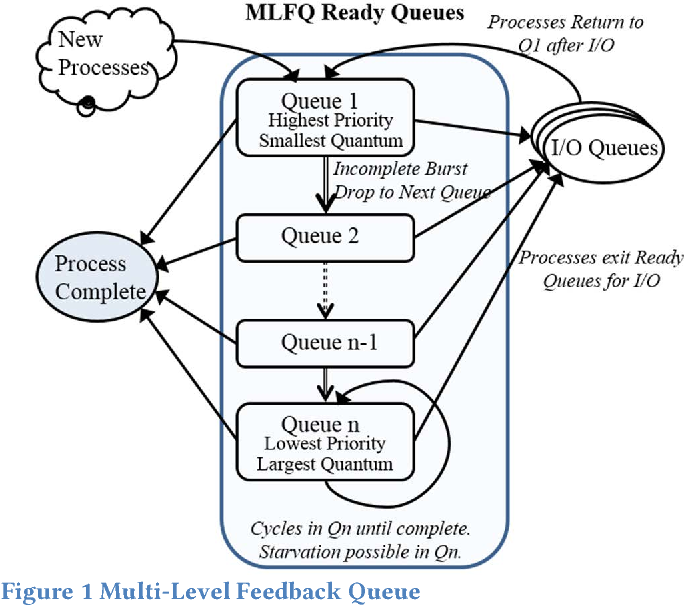
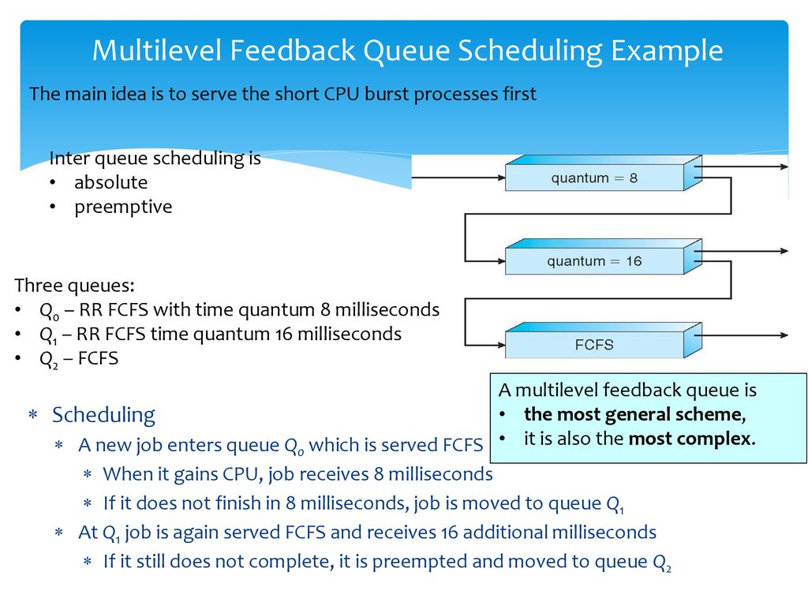

# MLQ & MLFQ (Multi-Level Queue & Multi-Level Feedback Queue)

## Multi-level queue scheduling (MLQ)

- **Ready queue is divided into multiple queues depending upon priority**.
- A **process is permanently assigned to one of the queues (inflexible)** based on some property of
process, memory, size, process priority or process type.
- Each **queue has its own scheduling algorithm**. E.g., **SP -> RR, IP -> RR & BP -> FCFS.**
    - (SP: System process, IP: Interactive process, BP: Batch process)
    - (RR: Round Robin, FCFS: First Come First Serve)

???+ info "more info"
    - **System process: Created by OS (Highest priority)**
    - **Interactive process (Foreground process): Needs user input (I/O).**
    - **Batch process (Background process):** Runs silently, no user input required

    ---

    - Scheduling among different sub-queues is implemented as fixed priority preemptive
    scheduling. E.g., foreground queue has absolute priority over background queue.
    - If an interactive process comes & batch process is currently executing. Then, batch process will
    be preempted.

!!! bug "Problems with `multi-level queue scheduling`:"
    - Only after completion of all the processes from the top-level ready queue, the further level ready queues will be scheduled.
    - **Starvation for lower priority process**.
    - **Convoy effect** is present.

---

## Multi-level feedback queue scheduling (MLFQ) 🥷🏻

- The one which is **actually used in practice in most of the systems**.

- Multiple sub-queues are present.

!!! example "what's new?"
    - **Process can move between queues**.
    - If a process uses **too much CPU time**, it will be **moved to lower priority queue** (to account for other processes).
    - If a process uses **too much I/O**, it will be **moved to higher priority queue**. (so that user can interact with it, else he will feel like system is hanging).
    - **Aging** is used to prevent starvation. (Aging: If a process **waits too much in a lower-priority** queue, it may be **moved to a higher priority** queue).

!!! success "Advantages of MLFQ:"
    - **Less starvation then MLQ**. (doesn't mean, it's completely free from starvation).
    - It is flexible.
    - Can be configured to match a specific system design requirement.

