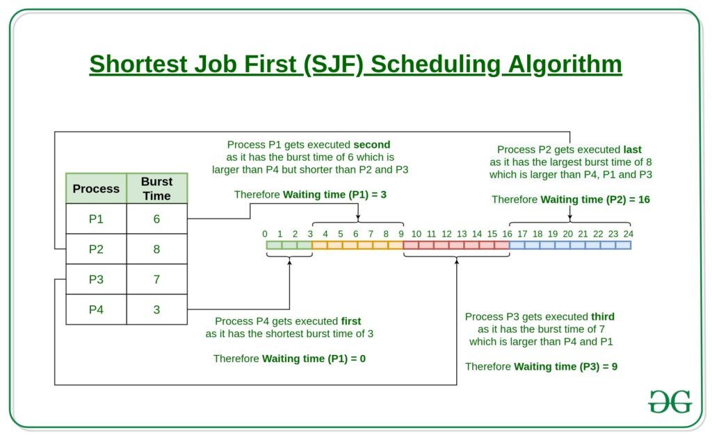
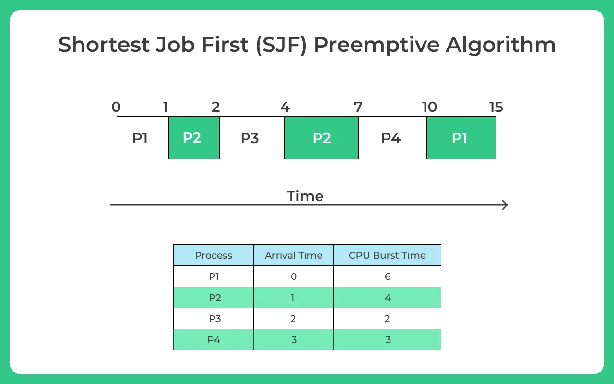
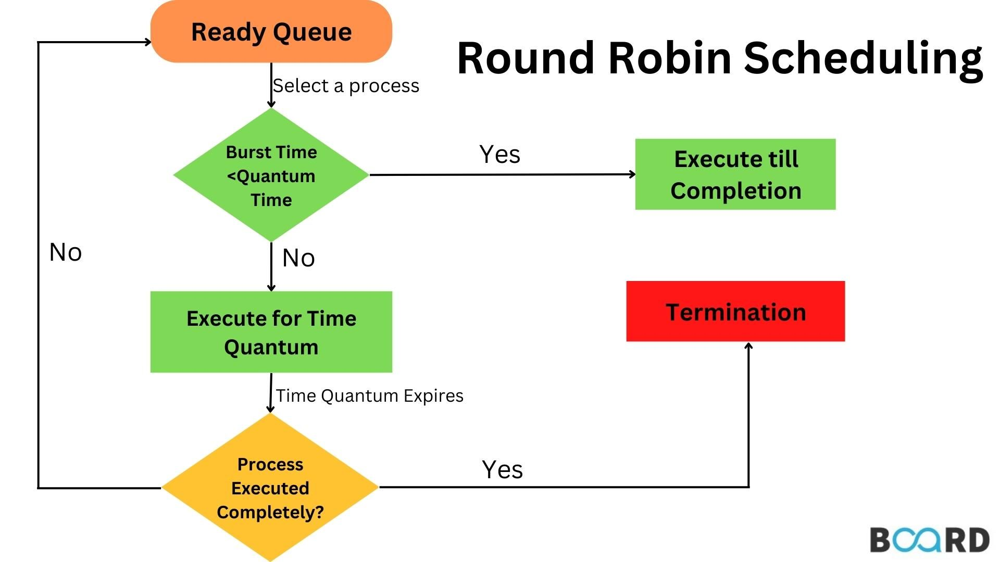

# SJF, Priority Scheduling & Round Robin

## Shortest Job First (SJF) Scheduling

??? info "Non-Preemptive SJF Scheduling"
    
    - Process with least BT (burst time) will be dispatched to CPU first.
    - Must do estimation for BT for each process in ready queue beforehand, **Correct estimation of BT is an impossible task (ideally)**.
    - Run lowest time process for all time then, choose job having lowest BT at that instance.
    - **This will suffer from convoy effect as if the very first process which came is Ready state is having a large BT.**
    - Process starvation might happen. (a shorter process might enter ready queue slightly later than a longer process, but it will wait for a long time before it gets CPU)

??? info "Preemptive SJF Scheduling"
    
    
    - **Less starvation**.
    - **No convoy effect**.
    - **Gives average WT less** for a given set of processes as scheduling short job before a long one **`decreases the waiting time of short jobs more than it increases the waiting time of long ones`**.

---

## Priority Scheduling 

??? info "Non-Preemptive Priority Scheduling"

    - **Priority is assigned to a process when it is created.**
    - SJF is a special case of general priority scheduling with priority inversely proportional to BT.

??? info "Preemptive Priority Scheduling"
    - Current running process can be preempted if a new process arrives with higher priority than the currently running process.

???+ bug "Problem with Priority Scheduling"
    - **Starvation**: Low priority processes may never execute.

    ---

    **Solution** 😎
    
    **Aging** (increase priority of process as it waits in the system).

    - e.g., **increase priority by 1 after every 15 seconds**

---

## Round Robin Scheduling

???+ info 
    - Most popular
    - Like FCFS, but preemption is added to switch between processes.
    - Designed especially for **time-sharing** systems.
    - Criteria: AT (arrival time) and TQ (time quantum).

!!! success "Advantages"
    - **Fairness**: All processes get equal share of CPU.
    - **No process starvation**.
    - **No convoy effect**.

!!! warning "Disadvantages"
    - **Too much context switching**.
    - If TQ is too large, it becomes FCFS.
    - If TQ is too small, too much context switching, and **increases overhead**.