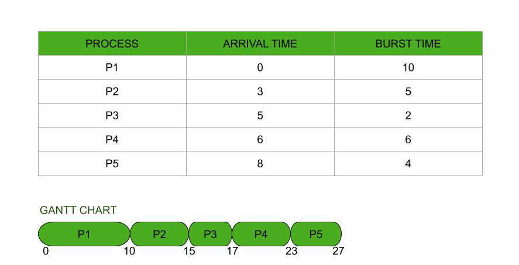
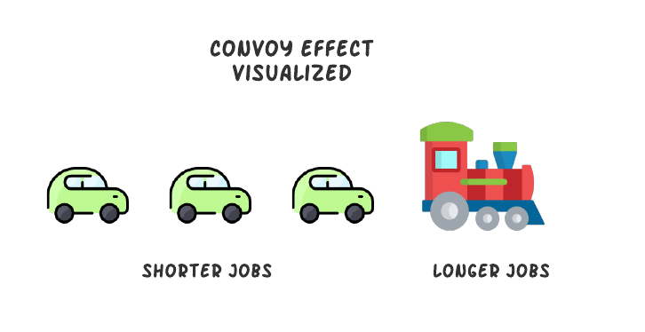

# FCFS & Convoy Effect

## FCFS (First Come First Serve) 🏁

- FCFS is simplest of CPU Scheduling Algorithm
- **Executes process that comes first.**
- It is **non-preemptive algorithm**.

!!! quote "Definition"
    Process that comes in ready queue first gets to be executed by the CPU first, then second one, then third one, and so on. The arrival time of processes is deciding factor here. Ready queue acts like FIFO (First In First Out) queue.

---

## Convoy Effect 😴

!!! bug "Convoy Effect"
    - **Convoy effect** is a situation where short processes are held up behind a long process.
    - **Shorter processes are made to wait for longer processes to complete.**
    - **This is a problem in FCFS.**
    - The **`average waiting time of different processes is very high`**.
    - Many process which require CPU for short time, are blocked by few processes which require CPU for long time.