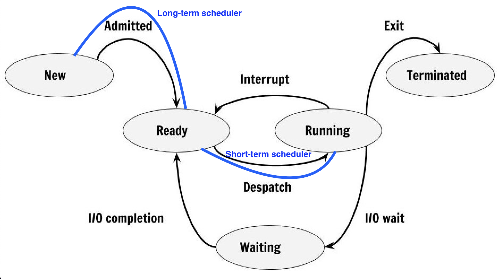

# Process State & Process Queue 👯

## Process State 🏃🏻

As process executes, it changes state. Each process may be in one of the following states:

- **New:** OS is about to pick the program & convert it into process. Or, the process is being created.

- **Run:** Instructions are being executed; CPU is allocated.

- **Waiting:** Waiting for IO.

- **Ready:** The process is in memory, waiting to be assigned to a processor.

- **Terminated:** The process has finished execution. PCB entry removed from process table.

!!! info "Process state"
    - **Long-term scheduler:** Selects which processes from a pool of **`new` processes** should be brought into the **`ready`** queue. It is called **`long-term`** because it is invoked infrequently (let's say after 1 second).
    - When a process is in **`ready state`**, it is waiting to be assigned to a processor. **Short-term scheduler** selects a process from the **`ready queue`** and assigns it to the processor. It is called **`short-term`** because it is invoked very frequently (let's say after every 100 milliseconds).
    - **Waiting state** is a temporary state. A process is moved to the waiting state if it needs to wait for a resource (like I/O) to become available. For example, if a process is waiting for user input, it will be in the waiting state. When the input is available, the process will be moved to the ready state and the short-term scheduler will pick a process from the ready queue and assign it to the processor.
    - **Terminated state** is the final state. The process has finished its execution and is removed from the system.
    - **Interrupt** is a signal to the OS that an event has occurred and needs immediate attention. It can be generated by the hardware or software. For example, an interrupt can be generated by a clock to indicate that a fixed interval of time has passed and the `running process` needs to be moved to the `ready queue` so that another process can be assigned to the processor.

???+ warning "Remember"
    - **Short-term scheduler**: **CPU Scheduler**.
    - **Long-term scheduler**: **Job Scheduler**.

??? bug "What is Dispatcher?"
    - It is the **module that gives control of the CPU to the process selected by the short-term scheduler**. It involves:
        - Switching context.
        - Switching to user mode.
        - Jumping to the proper location in the user program to restart that program.
        
    **Dispatch latency** is the time taken to stop running process and run another process which was in the ready queue.

---

## Process Queue 🚶🏻‍♂️

1. **Job Queue:**
    - Processes in new state.
    - **Present in secondary memory.**
    - `Job Schedular (Long term schedular (LTS)) picks process from the pool and loads them into memory for execution.`

2. **Ready Queue:**
    - Processes in Ready state.
    - **Present in main memory.**
    - `CPU Schedular (Short-term schedular) picks process from ready queue and dispatch it to CPU.`

3. **Waiting Queue:**
    - Processes in Wait state.

---

## Degree of multi-programming 📊

- The number of processes in the memory.
- The degree of multiprogramming describes the maximum number of processes that a single-processor system can accommodate efficiently.

!!! info "Who controls degree of multi-programming?"
    **LTS controls degree of multi-programming.** Because it decides how many processes are to be loaded into the memory (ready queue) for execution.