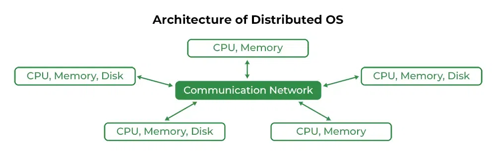

# Distributed Operating System

## Distributed Operating System

**A Distributed Operating System (DOS)** is a software system that manages a collection of independent, networked computers and presents them as a single unified system to the user. In this setup, the distributed OS controls and coordinates multiple machines (nodes) working together, allowing tasks to be executed across multiple computers transparently, as if they were on one machine.

* Loosely connected autonomous, interconnected nodes
* `>= 1 CPU, >= 1 memory, >= 1 GPU, etc.`
* Collection of independent, networked, communicating, and physically separate computational nodes.

## Key Features of a Distributed OS

!!! success ""

    1. **Resource Sharing :-**
    Resources like CPU, memory, storage, and peripherals are shared across multiple machines. Distributed OS allows for efficient load balancing by distributing tasks among available nodes to ensure optimal resource utilization.

    2. **Concurrent Processing :-**
    A distributed OS enables parallel processing by dividing tasks into subtasks and assigning them to different nodes. This leads to faster processing and greater computational power by using multiple machines in parallel.

    3. **Scalability :-**
    Distributed OSs are highly scalable, meaning that as more nodes are added to the system, overall performance improves. This allows organizations to increase their computing capacity by adding more machines without major changes to the software architecture.

    4. **Fault Tolerance :-**
    If one node in the distributed system fails, the OS can reroute tasks to other nodes, continuing execution without disrupting the entire system. Data replication across nodes also ensures redundancy, increasing the system’s overall reliability.

    5. **Networked Architecture :-**
    The underlying system comprises multiple networked nodes (computers), which communicate via a high-speed network. Each node may run its own OS, but the distributed OS orchestrates their cooperation as a unified system.

    6. **Security :-**
    Distributed OSs need advanced security mechanisms for authentication, authorization, encryption, and ensuring that users and processes on one node cannot interfere with others across the network.

---

## Application of Distributed O

!!! note ""

    * **Cloud Computing :-**
    Distributed OSs are used in cloud environments to manage multiple virtual or physical machines distributed across data centers. This is critical for Infrastructure as a Service (IaaS) and Platform as a Service (PaaS) models.
    
    * **Supercomputing and Grid Computing :-**
    Distributed OSs manage the resources of supercomputing clusters where multiple machines work together on highly complex calculations, like weather simulations, scientific research, or cryptography.
    
    * **Peer-to-Peer Networks :-**
    In P2P systems, distributed OS principles can be used to manage decentralized systems where tasks and resources are shared among peers without a central server.
    
    * **Distributed Databases :-**
    Distributed OSs are used to manage databases that span multiple locations, ensuring data consistency and availability across a network of machines.

