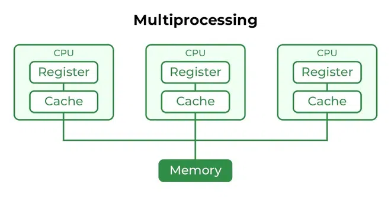
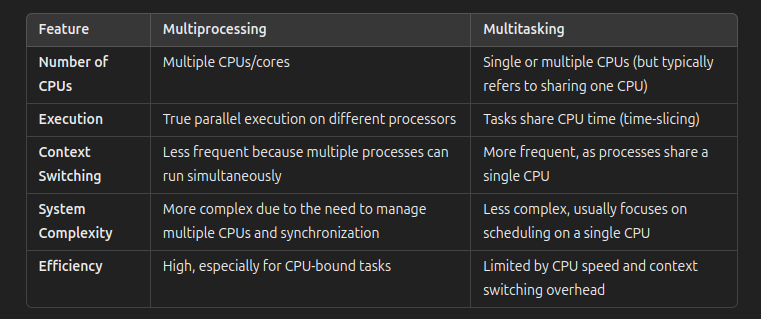

# Multi-Processing Operating System

## Multi-Processing Operating System

**A Multi-processing Operating System** is designed to support systems with **multiple processors or CPU cores** that can execute multiple processes simultaneously. Unlike multitasking, which switches between tasks on a single processor, multi-processing uses multiple CPUs to execute different tasks in parallel, providing true concurrent execution.

* More than 1 CPU in a single computer
* Increases reliability, if 1 CPU fails, the other is still running. Better throughput
* Lesser process starvation (if 1 process is running on 1 CPU, another process can run on another CPU)

## Key Features of a Multi-processing OS

!!! success ""

    1. **Multiple CPUs/Processors :-**
    The system contains more than one CPU, allowing it to process multiple tasks at the same time. Each CPU can work on a different process or task independently.

    2. **Parallel Execution :-**
    In a multi-processing OS, tasks can be processed simultaneously by different CPUs. This results in true parallelism, where multiple processes are actually running at the same time on different processors.

    3. **Increased Throughput :-**
    Because multiple CPUs can process tasks concurrently, the system can handle more jobs in a shorter amount of time, leading to increased overall throughput and performance.

    4. **Concurrency :-**
    Like multi-tasking, multi-processing also supports concurrency, but in a more efficient manner because multiple processes can run in parallel across different CPUs rather than switching between them on a single CPU.

    5. **Process Scheduling :-**
    The OS uses advanced scheduling algorithms to distribute tasks across multiple CPUs, ensuring that each processor is utilized efficiently. The load balancing ensures that no CPU is overloaded while others remain idle.

    6. **Reliability and Fault Tolerance :-**
    In some multi-processing systems, if one CPU fails, others can continue to work, making the system more reliable. The failure of a single CPU does not necessarily bring down the entire system.

---

## Advantages of Multi-processing OS

!!! exaple ""

    * **Increased Performance :-**
    By distributing tasks across multiple processors, the system can handle more tasks simultaneously, reducing the time needed to complete complex computations or run multiple applications.

    * **Efficient Resource Utilization :-**
    Multi-processing ensures that all available CPUs are utilized, which is especially beneficial for computationally intensive tasks like scientific simulations, large-scale data processing, or running multiple services on a server.

    * **Enhanced System Reliability :-**
    Fault tolerance is improved in some multi-processing systems, as the failure of one processor can often be handled without affecting the entire system.

    * **True Parallelism :-**
    Unlike multi-tasking, where tasks are rapidly switched in and out of the CPU, multi-processing allows multiple processes to actually run at the same time on different processors.

---

## Types of Multi-processing OS

### 1. Symmetric Multi-processing (SMP)
In SMP, all processors share the same memory space and have equal access to I/O devices. The OS assigns tasks to whichever processor is available, and each CPU operates independently but shares the workload evenly. Most modern operating systems, like Windows and Linux, use SMP.

### 2. Asymmetric Multi-processing (AMP)
In AMP, one processor (the "master") controls the system and assigns tasks to other processors (the "slaves"). The slave processors typically handle specific tasks and do not communicate with each other directly.

---

## Application of Multi-processing OS

!!! note ""

    * **Servers:** Multi-processing OSs are commonly used in servers, where multiple processors handle many user requests, ensuring high availability and fast response times. Web servers, database servers, and cloud infrastructure are typical examples.

    * **High-Performance Computing (HPC):** Supercomputers and HPC clusters rely on multi-processing OSs to perform parallel processing tasks, such as scientific simulations, weather forecasting, and large-scale data analysis.

---

## Multi-processing vs. Multi-tasking

!!! quote ""

    

