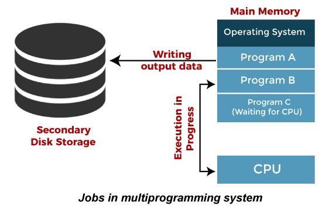

# Multi-Programming operating system

## Multi-Programming operating system

**Multi-programming OS** maintains a ready queue and increases CPU utilization by keeping multiple jobs(code and data) in the memory so that the **CPU** always has one to execute in case some job gets busy with I/O.This is basically used for better utilization of resources.

- Single CPU
- Context switching for processes.
- Switching happens when current process goes to wait state or I/O.
- When context switching happens, the running program writes/saves details in PCB (process control block).
- CPU idle time reduced.

## Benefits of Multi-Programming OS

!!! success ""

    * **Increased CPU utilization:** The CPU does not remain idle when a process is waiting for I/O, as it can execute another process.
    * **Throughput:** More jobs can be completed in a given period because the system is always executing some process.
    * **Better resource utilization:** Efficient use of memory, I/O devices, and other resources.

