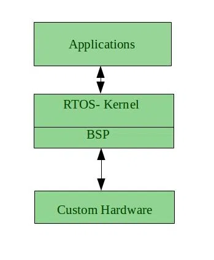

# Real-Time Operating System

## Real-Time Operating System

**A Real-Time Operating System (RTOS)** is a specialized operating system designed to process data and execute tasks within a strict and deterministic time frame, often in systems where timing is crucial. These systems are used in applications where a delay or failure to meet timing constraints can lead to serious consequences, such as in industrial control systems, automotive electronics, medical devices ect...

## Key Concepts in Real-Time OS

!!! success ""

    * **Jitter :-**
    Jitter refers to the variation in task execution time. A real-time system should have minimal jitter, meaning tasks should consistently complete within the same time window.

    * **Latency :-**
    This refers to the time it takes the system to respond to an external event (such as an interrupt). An RTOS aims to minimize latency to ensure fast and timely responses.

    * **Task Priority :-**
    Tasks in an RTOS are often assigned priorities. Higher-priority tasks are given preference in execution over lower-priority ones. Preemptive multitasking ensures that critical tasks can interrupt less important ones.

---

## Types of Real-Time OS

### 1. Hard Real-Time Systems

* In hard real-time systems, missing a deadline is unacceptable and can result in catastrophic consequences. These systems are used in mission-critical environments such as:

    * Aircraft control systems (e.g., autopilot)
    * Medical devices (e.g., pacemakers)
    * Industrial automation (e.g., robot controllers)

* A task’s deadline must be met every single time, and system failure is not tolerated.

### 2. Soft Real-Time Systems

* In soft real-time systems, deadlines are important but not as strict. Occasionally missing a deadline might result in degraded performance, but the system can still continue to operate.

    * Examples include multimedia streaming, online gaming, and telecommunications systems.

* While performance and responsiveness are crucial, missing a deadline occasionally is acceptable, though undesirable.

---

## Applications of Real-Time O

!!! example ""
    
    * **Aerospace and Defense :-**
    In applications like aircraft control systems, missile guidance, or military communication systems, hard real-time constraints are crucial for system success.

    * **Medical Devices :-**
    Medical equipment such as pacemakers, infusion pumps, and MRI machines rely on RTOSs to ensure timely responses to critical events.

    * **Telecommunication Systems :-**
    RTOSs are used in telecommunication systems to manage network traffic, ensure low-latency communications, and prioritize critical tasks in real time.

