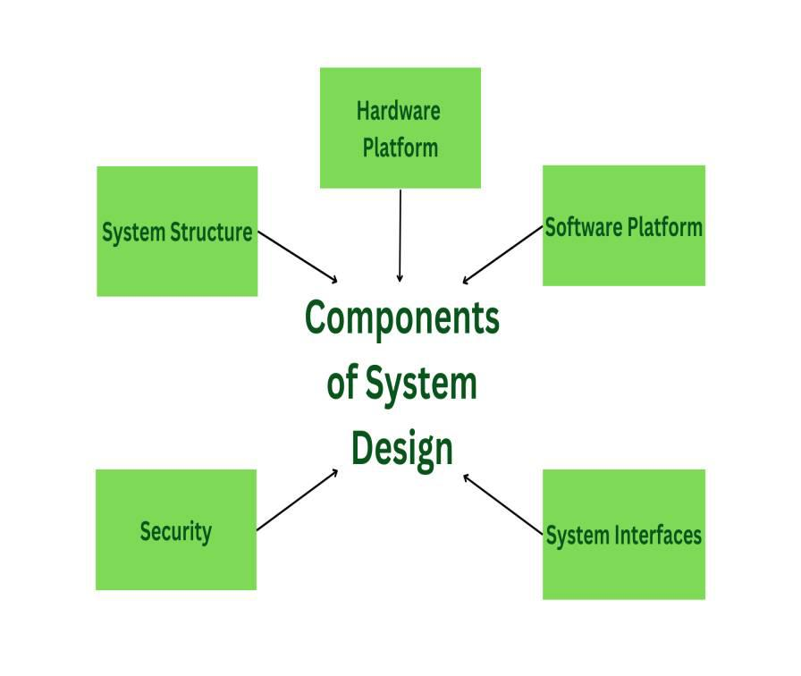

# Introduction to System Architecture

## Architecture of a System?

**Architecture** is a critical aspect of designing a system, as it sets the foundation for how the system will function and be built. It is the process of making high-level decisions about the organization of a system, including the selection of hardware and software components, the design of interfaces, and the overall system structure.

## Components consider when designing the architecture of a system

In order to design a good system architecture, it is important to consider all these components and to make decisions based on the specific requirements and constraints of the system. It is also important to consider the long-term maintainability of the system and to make sure that the architecture is flexible and scalable enough to accommodate future changes and growth.

* **Hardware Platform:** Hardware platform includes the physical components of the system such as servers, storage devices, and network infrastructure. The hardware platform must be chosen based on the specific requirements of the system, such as the amount of storage and processing power needed, as well as any specific technical constraints.

* **Software Platform:** Software platform includes the operating system, application servers, and other software components that run on the hardware. The software platform must be chosen based on the programming languages and frameworks used to build the system, as well as any specific technical constraints.

* **System interfaces:** System interfaces include the APIs and user interfaces used to interact with the system. Interfaces must be designed to be easy to use and understand and must be able to handle the expected load of users and requests.

* **System Structure:** System structure includes the overall organization of the system, including the relationship between different components and how they interact with each other. The system structure must be designed to be modular and scalable so that new features and components can be added easily.

* **Security:** Security is an important aspect of system architecture. It must be designed to protect the system and its users from malicious attacks and unauthorized access.

## Types of Architecture in system design

1. **Monolithic architecture**
2. **Microservices architecture**
3. **Event-driven architecture**
4. **Serverless architecture**

