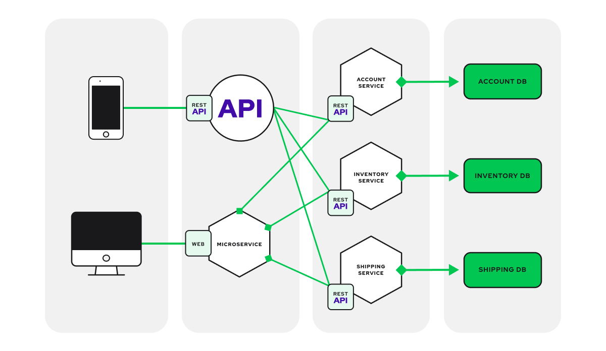

# Microservices Architecture

## What is a Microservices Architecture?

**In** a microservices architecture, an application is built as a collection of small, independent services, each representing a specific business capability. These services are loosely coupled and communicate with each other over a network, often using lightweight protocols like HTTP or messaging queues.

* Each service is responsible for a single functionality or feature of the application and can be developed, deployed, and scaled independently.

* The Microservice architecture has a significant impact on the relationship between the application and the database.

* Instead of sharing a single database with other microservices, each microservice has its own database. It often results in duplication of some data, but having a database per microservice is essential if you want to benefit from this architecture, as it ensures loose coupling.

## Advantages of using a Microservices Architecture

* **Scalability:** Microservices allow for individual components of an application to be scaled independently based on demand. This means that you can scale only the parts of your application that need to handle more traffic, rather than scaling the entire application.

* **Flexibility:** Microservices enable teams to use different technologies and programming languages for different services based on their specific requirements. This flexibility allows teams to choose the best tool for the job, rather than being limited to a single technology stack.

* **Resilience:** Since microservices are decoupled from each other, a failure in one service does not necessarily impact the entire application. This improves the overall resilience of the application and reduces the risk of downtime.

* **Agility:** Microservices enable teams to independently develop, test, deploy, and scale services, allowing for faster development cycles and quicker time-to-market for new features.

* **Easier Maintenance:** With microservices, it’s easier to understand, update, and maintain the codebase since each service is smaller and focused on a specific functionality. This can lead to faster development and debugging times.

* **Technology Diversity:** Different services in a microservices architecture can use different technologies, frameworks, and databases based on their specific requirements. This allows for greater flexibility and innovation in technology choices.

## Disadvantages of using a Microservices Architecture

* **Complexity:** Managing a large number of microservices can be complex. It requires careful coordination between teams and can result in a more complex deployment and monitoring environment.

* **Increased Overhead:** With microservices, there is overhead associated with managing the communication between services, such as network latency and serialization/deserialization of data. This can impact the performance of the application.

* **Deployment Complexity:** Deploying and managing a large number of microservices can be complex. It requires a robust deployment pipeline and automated tools to ensure that updates are deployed smoothly and without downtime.

* **Monitoring and Debugging:** Monitoring and debugging microservices can be more challenging compared to monolithic applications. Since each service is independent, tracing issues across multiple services can be complex.

* **Cost:** While microservices offer scalability and flexibility, they can also increase costs, especially in terms of infrastructure and operational overhead. Managing a large number of services can require more resources and investment in tools and infrastructure.

* **Testing:** Testing microservices can be more complex compared to monolithic applications. It requires a comprehensive testing strategy that covers integration testing between services, as well as unit testing within each service.

