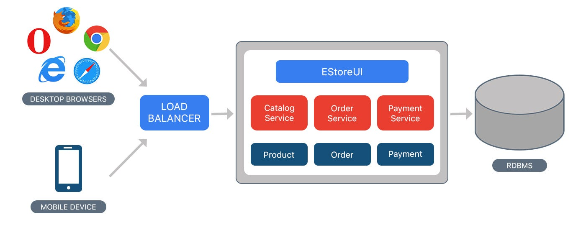

# Monolithic Architecture

## What is Monolithic Architecture?

**Monolithic architecture,** a traditional approach in system design, actually contains all components of an application into a single codebase.In this architecture, the entire application, including the user interface, business logic, and data access layers, is developed, deployed, and maintained as a single entity.

## Importance/Advantages of Monolithic Systems

* **Simplicity:** Monolithic architectures offer straightforward development and deployment processes. With all components bundled together, it’s often easier for developers to understand the system as a whole and make changes.

* **Cost-Effectiveness:** For small to medium-sized projects or startups, monolithic architectures can be more cost-effective. They require less infrastructure overhead and simpler deployment setups compared to distributed systems.

* **Performance:** In some cases, monolithic systems can provide better performance due to reduced communication overhead between components, as everything is running within the same process.

* **Security:** With fewer inter-service communication points, monolithic systems may have a reduced attack surface, making them potentially more secure, especially if proper security measures are implemented.

## Characteristics of Monolithic Architecture

Monolithic architecture exhibits several defining characteristics:-

* **Single Codebase:** All components of the application are developed and maintained within a single codebase, making it easier to manage and deploy.

* **Tight Coupling:** Components within the architecture are tightly integrated and interdependent, often sharing data and resources directly.

* **Shared Memory:** Monolithic applications typically share the same memory space, allowing components to communicate efficiently without the need for network overhead.

* **Centralized Database:** Data storage is centralized within the application, typically using a single database instance for all data storage needs.

* **Layered Structure:** Monolithic architectures often follow a layered structure, with distinct layers for presentation, business logic, and data access. While providing separation of concerns, this can lead to dependencies between layers.

## Challenges/Disadvantages in deploying Monolithic Architecture

Deploying monolithic architecture poses several challenges, including:-

* **Long Deployment Cycles:** Deploying a monolithic application typically involves deploying the entire codebase as a single unit. This can result in longer deployment times, as all components of the application need to be packaged, tested, and deployed together.

* **Risk of Downtime:** Deploying a monolithic application may require taking the entire system offline temporarily, especially if the deployment involves making significant changes or updates. This downtime can impact user experience and business operations.

* **Limited Scalability:** Scaling a monolithic application can be challenging, as scaling typically involves replicating the entire application stack. This can lead to inefficiencies and increased infrastructure costs, particularly during periods of high demand.

* **Resource Consumption:** Monolithic applications may consume more resources, such as memory and CPU, compared to more lightweight architectures like microservices. This can lead to higher infrastructure costs and reduced overall efficiency.

