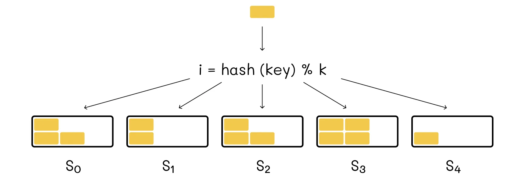
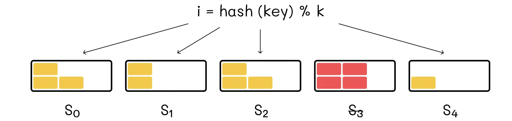
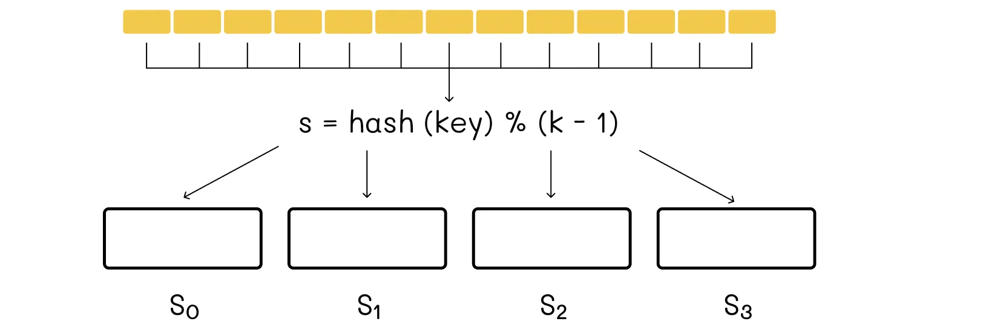
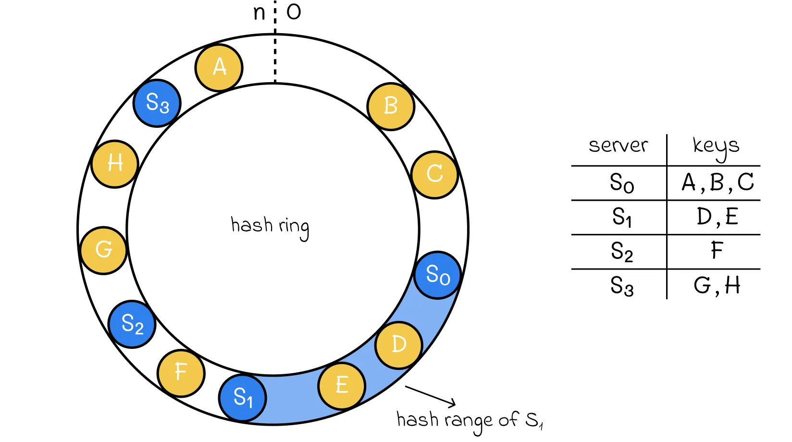
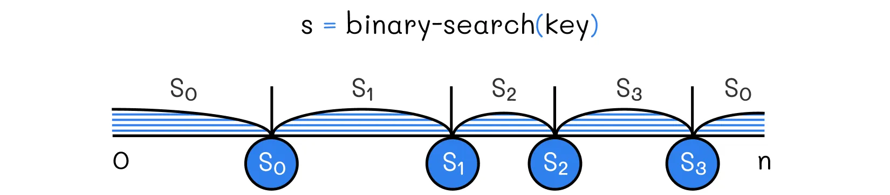
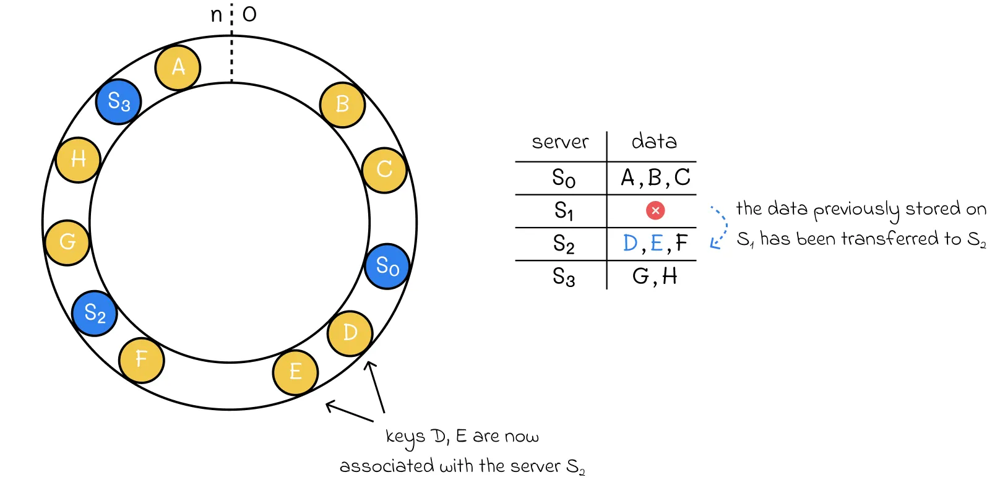
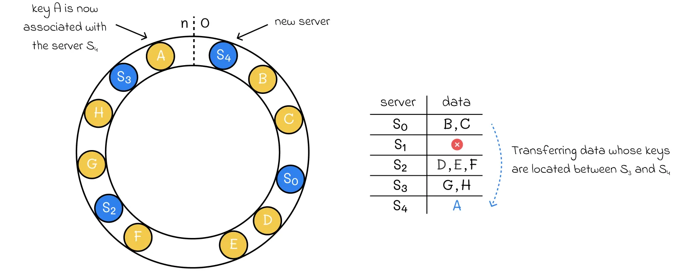
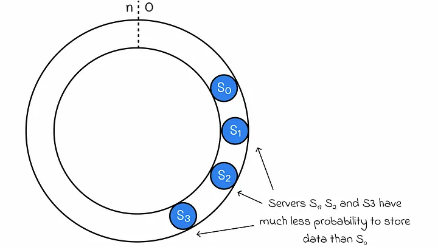
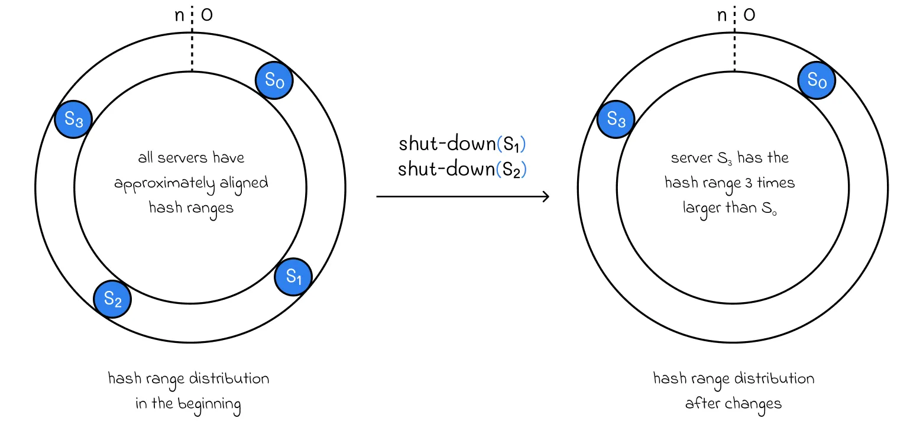
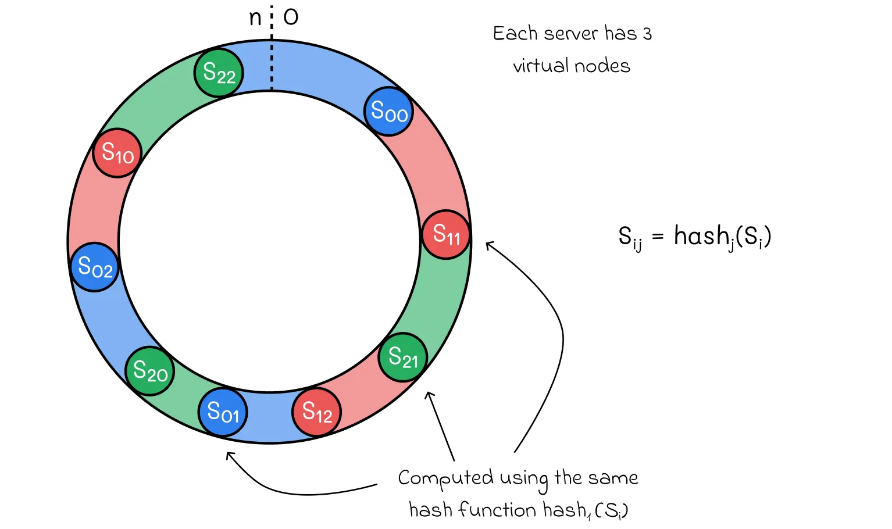

# Consistent Hashing

## Introduction

We are living in a world where data is massively generated every day. In large corporations, it is practically impossible to store all the data on a single server. That is why we need horizontal scaling where every data part is stored on a separate server.

## Problem

Imagine we have n data objects that need to be stored across k different servers. The configuration of servers can change over time:

* Any server can be shut down;
* A new server can be added to the system.

Given these potential configuration changes, we have to design a system that can rapidly retrieve required data blocks and transfer data between servers in the case of configuration changes.

---

## Naive implementation

The naive implementation includes the distribution of data across different servers based on a hash function. For instance, when we need to add a new data block to our system, we plug its key into the hash function that outputs the server number to which this block will belong to.

`Data distribution based on a hash function. The data is stored on servers with respect to corresponding hash values.`

When we need to retrieve information from a given key, we calculate its hash value to find out on which server the information associated with this key is stored.

This system works well until we make changes to it. For example, imagine that from the example above, the server S3 is shut down: we can no longer access its data and new data that will hash to its bucket will not be added.

`Whenever any of the servers is shut down, its data is no longer accessible.`

The only possible solution is to redistribute all the data blocks onto the servers again. Since we now have k-1 servers, we should not forget that the remainder in the hash function has to be reduced by 1. The analogous scenario would occur if a new server was added to the system.

`In the case of any system configuration changes, all the data needs to be redistributed again.`

Unfortunately, data redistribution is a resource-consuming operation. In the case of large data volumes and frequent changes in configuration, this storage system becomes very inefficient.

---

## Consistent hashing

**Consistent hashing** is a great alternative to the system above with much more resilience in case of any configuration changes.

Consistent hashing consists of hashing not only data but servers as well. **The data keys and servers are hashed to the same set of values [0, n].** To make it easier to understand and visualise, let us imagine that all of the hash values are located on a ring (or clock). Each server has its own **hash range.**

`A hash range of a server is defined as an interval of all hash values located on the hash ring before the server’s hash value and after the hash value of another closest server located in the counter-clockwise direction.`

To determine to which server a certain key belongs, we need to go into the clockwise direction starting from the hash value of the key until we reach the hash value corresponding to one of the servers. That server will store the data for this key.

`Hash ring example. The hash range for server S1 is depicted in blue.`

The hashed values for servers should be stored elsewhere in ascending order, so they can be rapidly accessed. Using binary search, this gives the ability to find a server storing a given key in O(log S) time (S is the number of servers).

`Using consistent hashing, the server number associated with a given key can be found in O(log S) time, where S is the total number of servers.`

### Shutting down a server

If any of the servers is shut down, then we simply need to delete the associated hash value of the server and transfer only the data from that server to the next server in the clockwise direction. That is a great advantage of consistent hashing in comparison to simple hashing since we no longer need to redistribute all the data as it was before.

`Shutting down server S1 from the example above requires only transferring data previously stored on that server.`

`After shutting down S1, the server S2 has expanded its hash range.`

### Adding a new server

If there is a need to add a new server to the system, then we only need to transfer all of the data associated with hash values located between the new server’s hash value and the hash value of the nearest server in the counter-clockwise direction.

`Adding a new server S4 to the system. Only part of the data stored on S0 has to be transferred to S4.`

`After adding S4, it took a part of associated hash values which previously belonged to S0.`

### Uneven distributions

While consistent hashing seems to be resilient to various configuration changes, there might come a moment in time when the data is distributed unevenly between servers.

* First of all, this might happen due to the chosen hash function. In reality, we cannot guarantee that it will uniformly generate keys for data. As a result, this can lead to a scenario when servers have very disproportional hash range lengths.

* Even if data is evenly distributed at a given moment of, with various configuration changes, it can sooner change drastically becoming uneven again.

**With** more uneven distributions, the average response time becomes proportionally longer.

One of the possible methods to mitigate this issue is to periodically redistribute all the data (possibly with another hash function) in the system when the distribution becomes skewed. While sometimes this might be a solution, it is still not optimal when having millions or billions of data objects.

### Virtual nodes

**Virtual nodes** are an extension of consisting hashing which makes the system more resilient to uneven data distributions. The idea consists of hashing each server several times (with different hash functions). The total hash range of every server is defined as the union of hash ranges associated with all of its keys.

`Consistent hashing with virtual nodes. Every unique color on the hash ring corresponds to one server.`

* Shutting down a server implies the deletion of all virtual nodes associated with the server. All of the data from that server will be transferred to other multiple servers.

* When adding a new server, all hash values for its virtual nodes should be calculated through the hash functions used before for other servers.

`In reality, the number of virtual nodes is usually much greater than in the example above.`

`On one hand, with the increase in the number of virtual nodes, hash ranges become on average more aligned. On the other hand, it takes more time to perform standard operations related to changes in configuration. Furthermore, additional metadata about virtual nodes needs to be stored.`

In most situations, it is better to choose the number of virtual nodes, based on a given problem, the number of available servers and data quantity. When it is difficult to estimate a good number, it is recommended to tune this parameter to find the perfect trade-off.

### Applications

Consistent hashing has a wide range of applications. Most of the time, it is used in distributed applications, especially in databases storing massive amounts of data on many servers. Some of the most popular examples are:

* **Apache Cassandra —** distributed NoSQL column database;
* **Amazon Dynamo DB —** distributed NoSQL key-value database;
* **Discord —** video and chat application.
