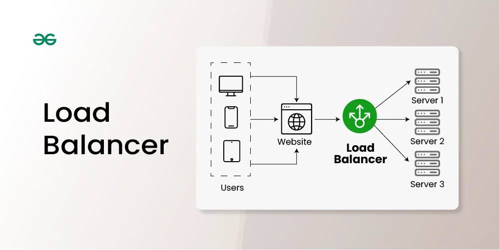
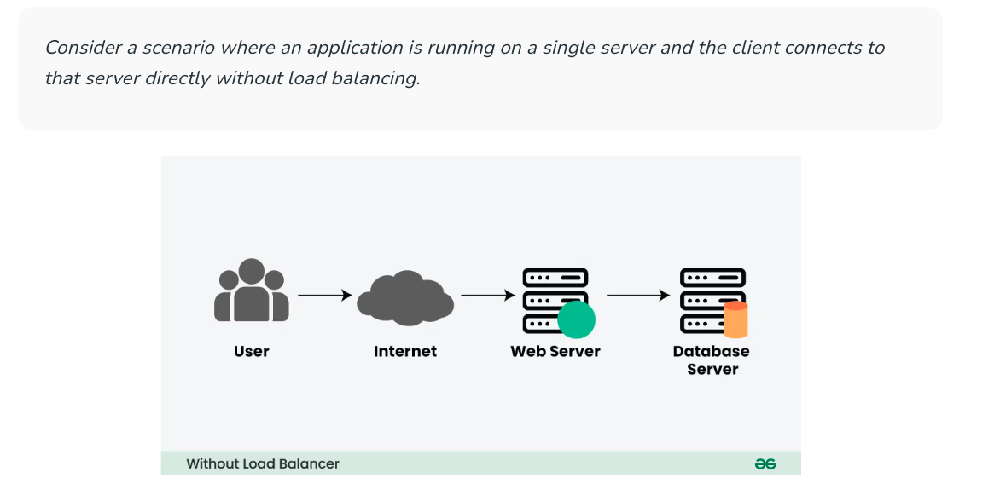
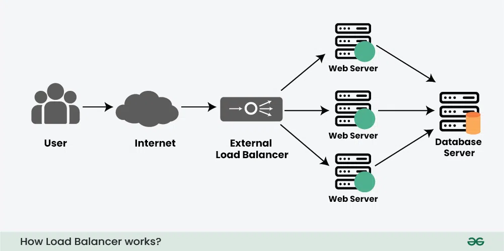

# Introduction to Load Balancer

## What is a Load Balancer?

**Load Balancer** is defined as a networking device or software application that distributes and balances the incoming traffic among the servers to provide high availability, efficient utilization of servers, and high performance.

* Load balancers are highly used in cloud computing domains, data centers, and large-scale web applications where traffic flow needs to be managed.
* The primary goal of using a load balancer is, not to overburden with huge incoming traffic which may lead to server crashes or high latency.

---

## What will happen if there is NO Load Balancer?

Before understanding how a load balancer works, let’s understand what problem will occur without the load balancer through an example.

**There are two main problems with this model:**

* **Single Point of Failure:** If the server goes down or something happens to the server the whole application will be interrupted and it will become unavailable for the users for a certain period. It will create a bad experience for users which is unacceptable for service providers.

* **Overloaded Servers:** There will be a limitation on the number of requests that a web server can handle. If the business grows and the number of requests increases the server will be overloaded.

## Key characteristics of Load Balancers:

1. **Traffic Distribution:** Load balancers evenly distribute incoming requests among multiple servers, preventing any single server from being overloaded.

2. **High Availability:** By distributing traffic across multiple servers, load balancers enhance the availability and reliability of applications. If one server fails, the load balancer redirects traffic to healthy servers.

3. **Scalability:** Load balancers facilitate horizontal scaling by easily accommodating new servers or resources to handle increasing traffic demands.

4. **Optimization:** Load balancers optimize resource utilization, ensuring efficient use of server capacity and preventing bottlenecks.

5. **Health Monitoring:** Load balancers often monitor the health of servers, directing traffic away from servers experiencing issues or downtime.

## How Load Balancer Works?

Lets understand how Load Balancer works through the above discussed example:

To solve the above issue and to distribute the number of requests we can add a load balancer in front of the web servers and allow our services to handle any number of requests by adding any number of web servers in the network.

* We can spread the request across multiple servers.
* For some reason, if one of the servers goes offline the service will be continued.
* Also, the latency on each request will go down because each server is not bottlenecked on RAM/Disk/CPU anymore.

Load balancers minimize server response time and maximize throughput. Load balancer ensures high availability and reliability by sending requests only to online servers Load balancers do continuous health checks to monitor the server’s capability of handling the request. Depending on the number of requests or demand load balancers add or remove the number of servers.