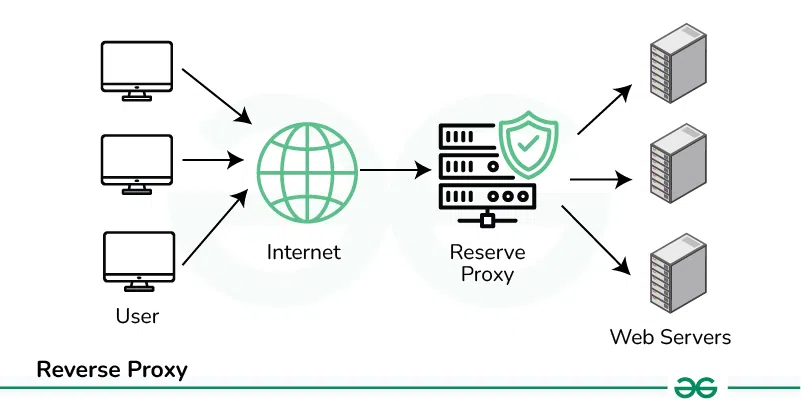
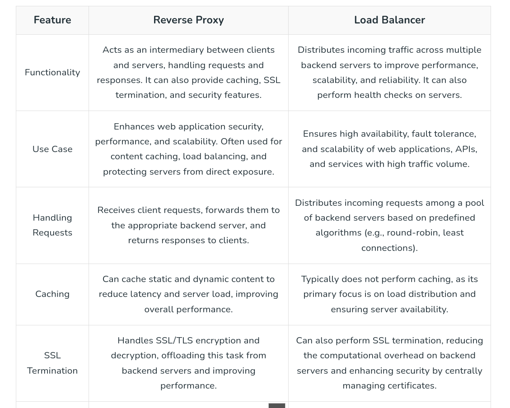
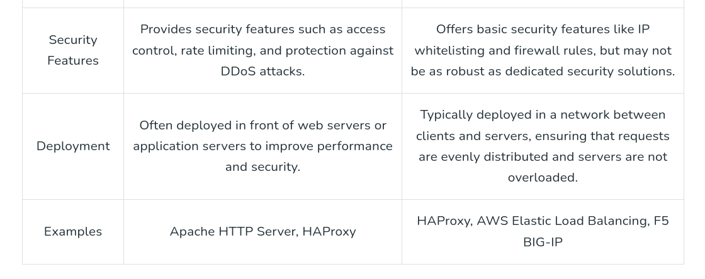
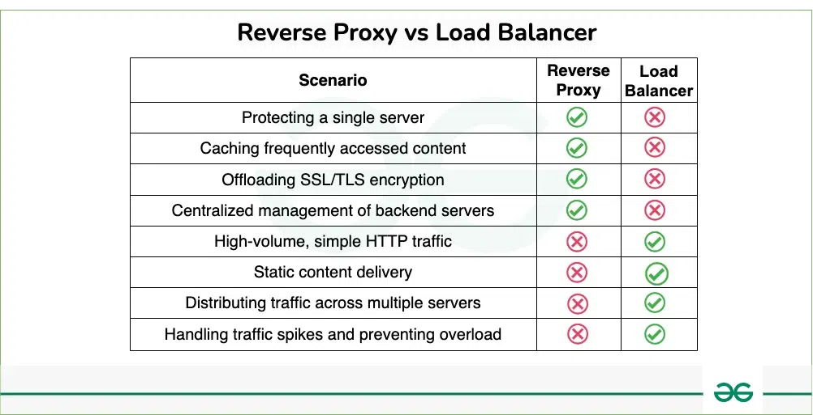

# Reverse Proxy

## What is Reverse Proxy?

A reverse proxy is a server that sits between client devices and backend servers, acting as an intermediary for requests from clients. When a client sends a request for a resource, such as a web page or an application, the reverse proxy receives the request on behalf of the backend servers. It then forwards the request to the appropriate backend server based on predefined rules or configurations.

* One of the key functions of a reverse proxy is to enhance security by serving as a barrier between the internet and backend servers. It can filter out malicious traffic, such as hacking attempts or spam, before it reaches the servers, thus protecting them from direct exposure to potential threats.

* Additionally, a reverse proxy can improve the performance of web applications by caching static content, such as images, CSS files, and JavaScript.

* By storing copies of frequently accessed content, the reverse proxy can serve these resources quickly to clients without needing to request them from the backend servers every time.

* This reduces latency and server load, improving overall performance for users.

## What are the differences between Reverse Proxy and Load Balancer?

Below are the differences between a reverse proxy and a load balancer:

## Best Scenarios for Reverse Proxy and Load Balancer

