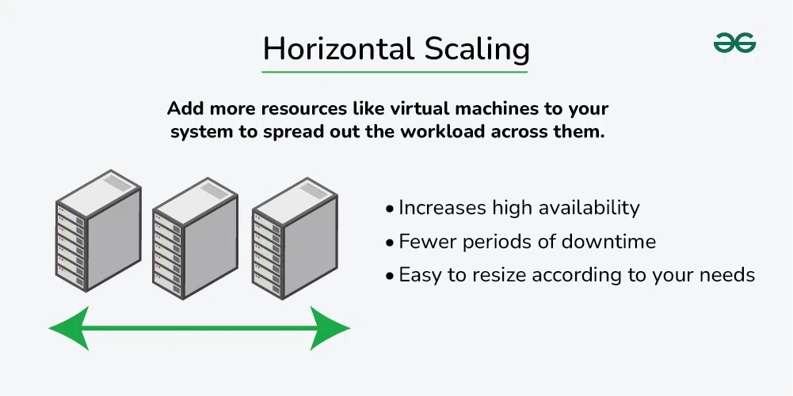
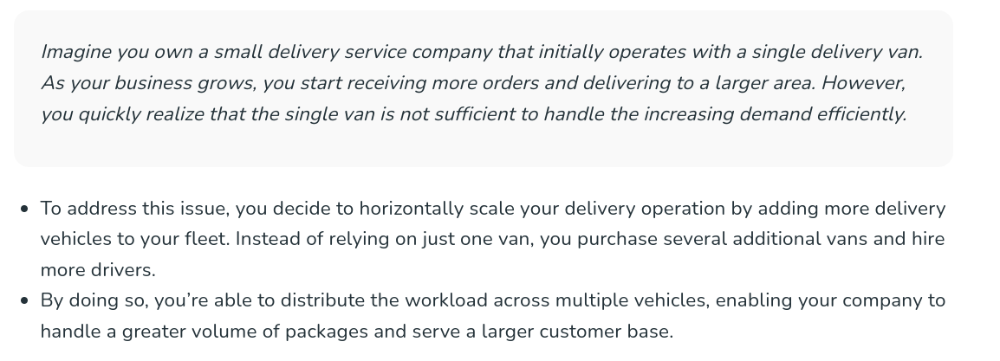

## What is Horizontal Scaling?

Horizontal scaling, also known as scaling out, refers to the process of increasing the capacity or performance of a system by adding more machines or servers to distribute the workload across a larger number of individual units.

**Example -** MongoDB, YouTube, Yahoo, Facebook, Amazon

## Advantages of horizontal scaling

* **Increased capacity:** More nodes or instances can handle a larger number of incoming requests.

* **Improved performance:** Load can be balanced across multiple nodes or instances, reducing the likelihood of any one server becoming overwhelmed.

* **Increased fault tolerance:** If one node fails, incoming requests can be redirected to another node, reducing the risk of downtime.

## Disadvantages of horizontal scaling

* **Increased complexity:** Managing multiple nodes or instances can be more complex than managing a single node.

* **Increased cost:** Adding more nodes or instances will typically increase the cost of the system.
