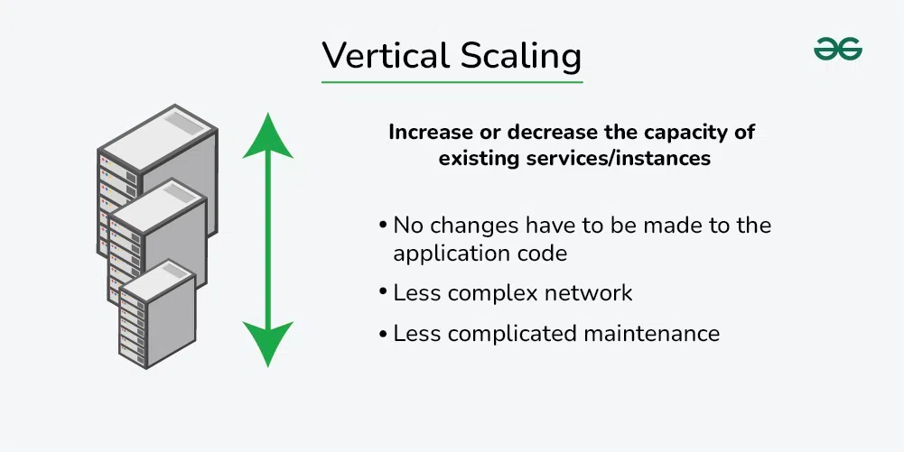
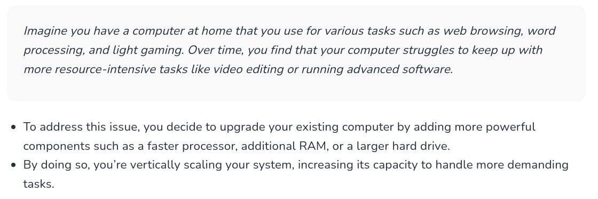

## What is Vertical Scaling?

Vertical scaling, also known as scaling up, refers to the process of increasing the capacity or capabilities of an individual hardware or software component within a system. You can add more power to your machine by adding better processors, increasing RAM, or other power-increasing adjustments.

**Example -** MySQL, Amazon RDS

## Advantages of vertical scaling

* **Increased capacity:** Upgrading the hardware of a server can improve its performance and increase its capacity to handle incoming requests.

* **Easier management:** Vertical scaling typically involves upgrading a single node, which can be less complex than managing multiple nodes.

## Disadvantages of vertical scaling:

* **Limited scalability:** Vertical scaling is limited by the physical constraints of the hardware, whereas horizontal scaling can be easily expanded by adding more nodes.

* **Increased cost:** Upgrading the hardware of a server can be more expensive than adding more nodes.
Single point of failure: All incoming requests are still directed to a single server, which increases the risk of downtime if the server fails.

